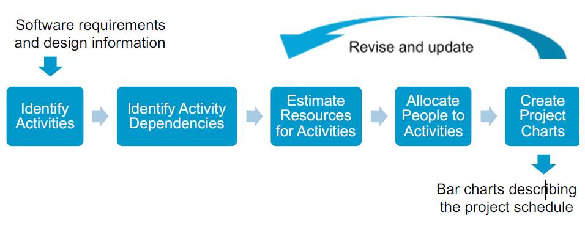
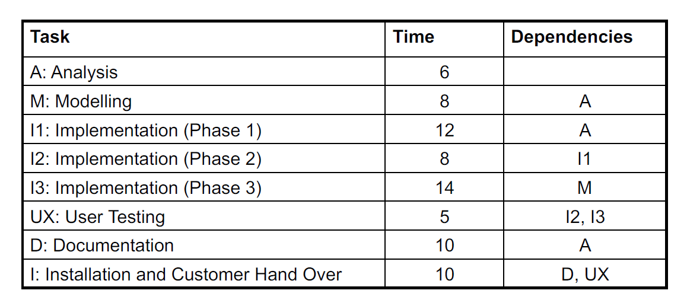
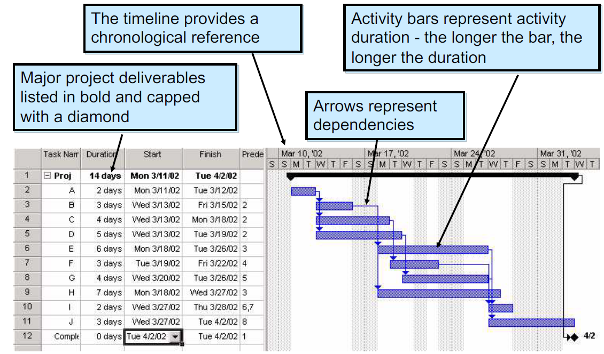
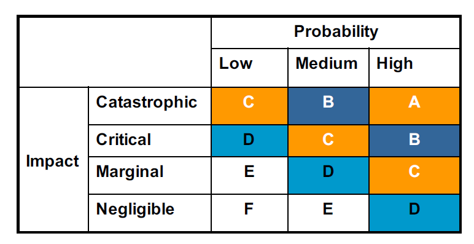

# Advance Software Design: Project Management <!-- omit in toc -->
- [Preface: No Silver Bullet](#preface-no-silver-bullet)
- [Project Management Tools](#project-management-tools)
- [Scope of a Project](#scope-of-a-project)
    - [Defining Scope](#defining-scope)
- [Determining Feasibility](#determining-feasibility)
- [Project Planning Goals - AKA scope](#project-planning-goals---aka-scope)
    - [Project Planning Deliverables](#project-planning-deliverables)
    - [Project Planning Schedule](#project-planning-schedule)
    - [Project Planning Supporting Plans](#project-planning-supporting-plans)
- [The Range of Management Activities](#the-range-of-management-activities)
- [People](#people)
    - [Roles and Responsibilities](#roles-and-responsibilities)
    - [Essential Roles in Small Software development teams](#essential-roles-in-small-software-development-teams)
    - [Choosing People](#choosing-people)
    - [Managing with different Personality Types](#managing-with-different-personality-types)
    - [Management and Team Success](#management-and-team-success)
- [Estimation and Metrics](#estimation-and-metrics)
    - [Milestones and Deliverables](#milestones-and-deliverables)
    - [Why Software Metrics?](#why-software-metrics)
    - [Software Metrics Characteristics](#software-metrics-characteristics)
    - [Are Software Metrics Worth Anything?](#are-software-metrics-worth-anything)
    - [Metrics for Object Oriented Development](#metrics-for-object-oriented-development)
- [Scheduling](#scheduling)
    - [Project Scheduling](#project-scheduling)
    - [Critical Path or Network Analysis](#critical-path-or-network-analysis)
    - [What is Network Analysis?](#what-is-network-analysis)
    - [Terminology](#terminology)
    - [Network Analysis](#network-analysis)
- [Gantt Charts](#gantt-charts)
- [Risk](#risk)
    - [Managing Risks](#managing-risks)
    - [Boehm's Top Ten Risk Items +2](#boehms-top-ten-risk-items-2)
    - [Risk Matrix](#risk-matrix)
    - [3M's](#3ms)
- [Questions](#questions)
- [Conclusion](#conclusion)
    - [Planning vs. Management](#planning-vs-management)
    - [Tips on Project Control](#tips-on-project-control)
- [Resources](#resources)
# Preface:  No Silver Bullet
There is no technique that fixes the inherent complexity of software design and development.
# Project Management Tools
* Basecamp
* Freedcamp
* TeamGantt
* Asana
* Overleaf
# Scope of a Project
* The functions and features that are to be delivered to end-users
* The data that is considered input and output
* The content that is presented to users as a consequence of using the software
* The performance, constraints, interfaces and reliability that bound the system
## Defining Scope
* Scope is defined using one of two techniques
    * A narrative description of software scope is developed after communication with stakeholders
    * A set of use-cases is developed. A use-case is a scenario-based description of the user's interaction with the software from the user's point of view.
* Performance considerations encompass processing and response time requirements.
* Constraints identify limits placed on the software by external hardware, available memory, or other existing systems.
# Determining Feasibility
* Given the scope, determine the resources required.
    * Cost
* Make sure you have an answer to the question:
    * Do we have the resources we need to build this software?
* Resources are:
    * People
    * Hardware and software tools
    * Reusable components
# Project Planning Goals - AKA scope
* Goals are derived from the needs and expectations of stakeholders:
    * Project sponsor
    * Customer for deliverables
    * Users of the project outputs
    * Project manager and project team
* Find true needs that create real benefits
    * Prioritize them
* Create measurable goals
    * S - Specific, significant, stretching
    * M - Measurable, meaningful, motivational
    * A - Agreed upon, attainable, achievable, acceptable, action-oriented
    * R - Realistic, relevant, reasonable, rewarding, results-oriented
    * T - Time-boxed, time-based, time-bound-timely, tangible, trackable.
## Project Planning Deliverables
* Deliverables are a list of items that have to be delivered to meet the goals
    * Verifiable and specific
    * Can be a report, equipment acquisition or an executable code module etc
    * Has a stakeholder who needs it
* Say when it has to be delivered
* Give quality standards
    * Document is according to specified format
## Project Planning Schedule
* The effort required (in terms of time)
* The people required (and other resources)
* Update deliverables with this & work schedule out
* If the schedule is unrealistic you can justify some of the following:
    * Renegotiate deadline - delay
    * Additional resources - more expensive
    * Reduce scope - fewer deliverables
## Project Planning Supporting Plans
Human Resource Plan
* Name key individuals and organisations: describe roles and responsibilities
* Describe the number and type of people needed
    * Start dates etc

Communication and Management Plan
* Who needs to be kept informed about the project
* How they will receive the information?
    * Weekly review meeting
    * Progress reports
    * Revised schedule
  
Risk Management Plan
* Identify as many risks as possible
* Be prepared if something bad happens

Marketing Plan
* Important to get funding

# The Range of Management Activities
**P**eople
* Managers, Project Managers, Team Leaders, Software Team, Customers, End-Users

**P**roduct 
* Scope and decomposition

**P**rocess
* Software Development Life Cycle (SDLC): initiation -> Analysis -> Design -> Construct -> Test -> Implement 
* Unified Process (UP): Inception -> Elaboration -> Construction -> Transition -> Production

**P**roject
* Size estimation, scheduling, risk management, tracking

# People
## Roles and Responsibilities
It seems obvious that a team needs people with different skills
* Range of duties in a small project
    * Project management: Strategist, Leader, Politician, Project Facilitator, Administrator
    * Systems analysis: Stakeholder needs, Interaction Designer, Cost estimator
* User interface designer, user stories
* Architect: Application overview, performance
    * Middleware — software layer between the operating system and the applications on a distributed computer network
* Specialists as required: database, games engine, mobile development, etc
* Documentation: Amanuensis (One who takes dictation or copies manuscripts)
* 

## Essential Roles in Small Software development teams
1. Course Developer
    * Prep and coordination of training
2. Database Designer
    *  Essential to the process
        *  Mainly due to the specific nature of their knowledge
3. Implementer
    * Programs sub-systems
    * Components that support the desired functionality
4. Integrator (lead programmer)
    * Responsible for maintaining the Implementer's awareness of the project context
    * Identifying the tasks to be undertaken and for appointing the person responsible for each one
    * Responsible for the initial definition of the critical dates of the project and for developing a plan for the integration of the sub-system
    * To allow the project manager to inform the client when each feature is expected to be available
5. Process Engineer
    * Mainly concerned with the management of the development process
    * Its adaptation to organisational context
    * Monitoring its implementation to identify and implement process improvements
6. Project Manager
    * Assume a global overview of the project through a detailed interaction with the internal and external participants
    * Must create the conditions for the project to achieve success, by ensuring timeliness and fulfilment of all commitments
    * Requires
        * Basic knowledge in management
        * Knowledge about the client’s business domain
        * Project management methodologies
        * Negotiation skills.
7. Project Reviewer
    * This role cannot be considered critical.
    * However, due to responsibilities related to the verification and approval of several artefacts produced by other participants, and possible conflict of interests, this person cannot have another role within the project
8. Software Architect
    * Responsible for setting the technological foundation on which the project implementation should be based
    * Also responsible for managing the technical risks
9.  Systems Administrator
    * Focused on ensuring the provision of the infrastructure needs 
        * E.g.: PC for developers, servers, etc
10. Systems Analyst
    * Scope management
    * Identify and document the requirements (functional or non-functional) 
    * Understand the client's business domain
    * Perceive the real motivations and relevance of the requirements
11. System Tester
    * Entrusted with very different tasks
        * like review of documentation and testing behaviour
12. Test Manager
    * Responsibility is to ensure the product quality by devising a plan for internal quality audits and implementation
    * Cannot have other roles, particularly with those roles related to the design and construction
13. UI Designer
    *  The scope of this role in a project varies according to the nature of the artefacts to be developed
## Choosing People
* Information from candidates about their background and experience
    * Best evidence to judge suitability
* Information from interviewing candidates
    * Mainly judge communications and social skills
    * Subjective - not reliable
    * Can ask candidate to perform specific exercises
* References and Recommendations from people who have worked with them
    * Effective when you can rely on the people making the recommendation
## Managing with different Personality Types
* Backgrounds and personality styles of team members
* Management styles of customers and developers
* Realize that other people are not like you
* Can use Jung + Myers-Briggs personality model
* Different kinds of personalities need different kinds of motivation, recognition and rewards
## Management and Team Success
* Most software engineering is a group activity
    * Non-trivial software projects cannot be done by one person
    * People motivated by success of the group and their own personal goals
* Individual success depends on:
    * Ability and interest to work hard
    * Experience and training with similar applications, development tools, programming languages
* Team success depends on:
    * Ability to communicate and express ideas in the team
    * Group interaction is a key determinant of group performance
* Management skills
    * Limited flexibility in group composition: do the best with people available
# Estimation and Metrics
## Milestones and Deliverables
* Activity - Task that takes time
    * Duration - length of time needed for an activity
    * Due date - date for completion of the activity
    * Precursor - activity which precedes others that depends on it
* Milestone
    * Completion of an activity
    * Recognizable end-product of a task
        * Hand over system for testing
    * Requires a formal, measurable output
* Deliverable
    * A project result that is delivered to a customer
* Milestone vs Deliverable
    * Deliverable is a measurable and tangible outcome of the project. They are developed by project team members in alignment with the goals of the project.
    * Milestones on the other hand are checkpoints throughout the life of the project. They identify when one or multiple groups of activities have been completed thus implying that a notable point has been reached in the project.
## Why Software Metrics?
* To plan and manage a software development projects
    * Need to estimate the resources required for each of its constituent activities
        * Subjective perceptions of the activity
        * Based upon measurements of size and complexity
            * Activity itself
            * Artefact that is produced
    * Software metric measures some aspect of software development
        * Project level - cost or duration
        * Application level - size or complexity
## Software Metrics Characteristics
* Process Metrics
    * Process metrics measure some aspect of the development process
        * Project cost to date
        * Amount of time spent so far on the project
        * (These change all the time)
* Product Metrics
    * Product metrics measure some aspect of the software product.
        * Analysis model
            * number of classes in an analysis class diagram
        * test plans
        * program code
* Result Metrics
    * Measure outcomes
        * Current cost of a project 
    * Also known as control metrics
        * used to determine how management control should be exercised
            * Measurement of the current level of progress in the project is used to decide whether action is necessary to bring the project back onto schedule.
* Predictor Metrics
    * Quantify estimates for project resource requirements
        * Class size
            * A crude measure might be a simple count of attributes and operations.
            * Predictor because it can be used to predict the time that it will take to produce code.
    * Also measure of some aspect of a software product that is used to predict another aspect of the product or project progress.
        * Predict that the system will be difficult to maintain
        * Predict very low levels of reuse
        * Change the design to improve the system
## Are Software Metrics Worth Anything?
* Useful for prediction and resource estimation
    * Otherwise use of software metrics is rather limited
* Validity of predictor metrics is based on 3 assumptions
    * You can measure something useful
    * That measure actually predicts something worthwhile
    * The relationship is real and can be expressed in a model or a formula.
* Size metrics can be used to estimate the resource requirement for a project provided that appropriate historical data is available to derive and validate the relationship.
## Metrics for Object Oriented Development
* Ability of a package to absorb change is partly dependent on ratio of abstract classes to all classes.
    * 0 - has concrete classes and is difficult to change
    * 1 - has no concrete classes at all (easy to change)
* Application size
    * Number of use cases
    * Number of domain classes
* Class size
    * Number of attributes
    * Number of operations
    * size of operations
# Scheduling
## Project Scheduling
* Split the work in a project into separate tasks
    * Minimize tasks dependencies where one tasks wait for another to complete
* Estimate the calendar time needed to complete each task
    * Split up if much longer than 1 week
    * Make tasks concurrent to make optimal use of workforce
* Estimate the effort required
    * Who will work on the tasks
    * Resources needed to complete each task
* Mostly needs project manager's intuition and experience. 

## Critical Path or Network Analysis
* Related to PERT Charts
* Minimum overall duration of the project according to the estimates depends on the critical path(s)
* Any delay of a task on the critical path delays the whole project.
## What is Network Analysis?
* Project Tasks
    * Often interdependent
    * But need to be done in parallel for teamwork to be effective
* Task networks are graphical depictions of task dependence
* Network analysis is a project planning method that
    * Determines the critical path
    * Establishes "most likely' time estimates
    * Calculates boundaries to stop project slippage.
## Terminology
* Earliest Start/Finish
    * Earliest a task can begin/end if all preceding tasks are completed in the shortest time
* Latest Start/Finish
    * Latest a task can begin/end without delaying the minimum project completion time
* Critical Path
    * Chain that determines overall project duration
    * Can be multiple critical paths (not just one)
* Slack (Float)
* The amount of surplus time or leeway allowed while still maintaining the critical path

## Network Analysis
Tasks are shown as boxes
sequences constraints are lines connecting the boxes

The following steps are better illustrated in the [this](docs/networkanalysis.pdf) document.
* Step 1
    * Label Tasks in order and indicate dependencies.
* Step 2
    * From the estimated time for each activity
    * Carry out a "forward pass"
    * Fill in Earliest Start, Earliest Finish
* Step 3
    * Carry out "backward pass"
    * Fill in latest start, latest finish
* Step 4
    * Fill in total float
        * Time by which an activity may be delayed without affecting the final completion date
* Step 5
    * Fill in Free Float
        * Amount of time an activity can expand without affecting the start or finish of any other activity
    * FF = ES (next) - EF (current)
* Critical Path
    * This path is the manager's primary concern

Here is an example:

TODO
* Finish Example
# Gantt Charts
* Horizontal Bar Chats
    * Horizontal axis represents project time span
    * vertical axis represents project tasks
* Capture
    * Task completion
    * Simple dependencies
    * Milestones and Deliverables
* Can't handle complex task dependencies
* Supported by automated scheduling tools
    * Microsoft project 
* Possible options:
    * Teamgantt
    * Microsoft project
* Visualize entire project

Before Project

During project

# Risk
## Managing Risks
* Why?
    * Projects have a high level of uncertainty
    * Better to anticipate problems in advance
* How?
    * Identify specific risks to the project
    * Analyze the risks
    * Rank them in a particular order
    * Plan for monitoring, mitigation, management
    * Revisit continually during project
## Boehm's Top Ten Risk Items +2
* Being blindsided by the competition
* Outside interruptions
  1. Personnel shortfalls - failure to recruit or retain key staff
  2. unrealistic schedules and budgets
  3. Developing the wrong functions
  4. Developing the wrong user interfaces
  5. Gold-plating
  6. Continuing stream of requirements changes
  7. Shortfalls in externally-performed tasks
  8. Shortfalls in externally-furnished components
  9. Real-time performance shortfalls
  10. Straining computer science capabilities
## Risk Matrix
* Sort risk by a combination of:
    * Probability (high, medium, low)
    * Impact - catastrophic (project failure), critical (massive delay), marginal, negligible

## 3M's
* Mitigation
    * How can we void or reduce the risk?
        * Avoid the riskL change requirements
        * Transferring the risk: e.g.: buy insurance
    * Or assume the risk and accept and control it
* Monitoring
    * What factors can we track that will enable us to determine if the risk is becoming more or less likely?
* Management
* What contingency plans do we have if the risk becomes a reality

[Example of risk](docs/examplesofrisks.pdf)

# Questions
1. Which of the following statements best describes how one goes about identifying the critical path:
    * a) Find those milestones where the earliest start time is equal to the latest start time <--- Answer
    * b) Find those milestones where the earliest start time is less than the latest start time
    * c) Find those milestones where the earliest start time is greater than the latest start time
    * d) Find those milestones with some scheduling flexibility
    * e) None of the above
2. What does the term GANTT stand for
    * nothing
3. Which of the following statements best explains what is meant by slack time in Critical Path Analysis?
# Conclusion
## Planning vs. Management
* Planning
    * Pre and Post
    * Network analysis, resourcing, risks, schedule
* Management
    * During
    * Controlling resources and timescales

## Tips on Project Control
* Remember to update planning documents
    * Show progress in Gantt chart
    * Reassess risks
# Resources
* Bennett, McRobb & Farmer, Object-Oriented Systems Analysis and Design: Using UML, McGraw-Hill. Chapter 22: Managing Object-Oriented Projects.
    * Available [here](highered.mcgrawhill.com/sites/0077125363/student_view0/online_chapters.html)
* Sommerville, Software Engineering, Pearson
    * Chapter 22: Project management: Risk management, Managing people, Teamwork 
    * Chapter 23: Project planning, Software pricing, Plan-driven development, Project scheduling, Agile planning, Estimation techniques
