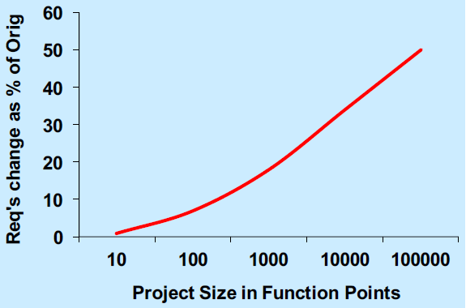
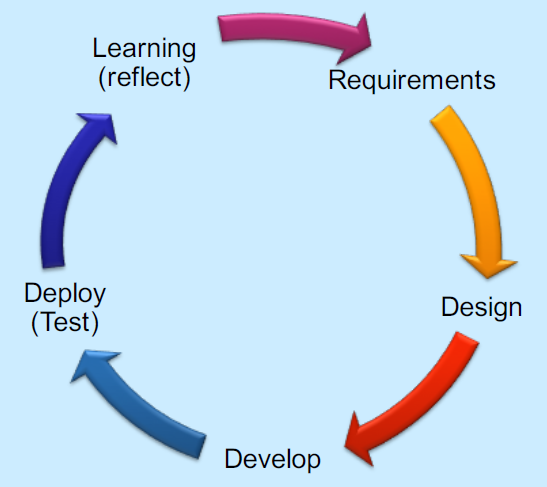
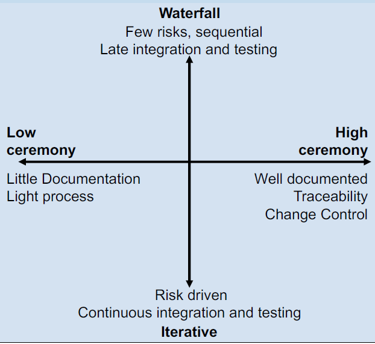

# Software Project Management Methods <!-- omit in toc -->
- [Problems](#problems)
    - [Observations](#observations)
    - [Software Engineering Triangle](#software-engineering-triangle)
    - [Think Big, Act Small](#think-big-act-small)
    - [Wasted Effort](#wasted-effort)
    - [You Ain't Gonna Need It (YAGNI)](#you-aint-gonna-need-it-yagni)
    - [Economies of Adding Features](#economies-of-adding-features)
    - [The Crunch](#the-crunch)
    - [Software Entropy, Rot & Geriatrics](#software-entropy-rot--geriatrics)
    - [Yak Shaving](#yak-shaving)
    - [So we have](#so-we-have)
- [Traditional SE Methods](#traditional-se-methods)
    - [Naive Approach](#naive-approach)
    - [Traditional Methods](#traditional-methods)
    - [Waterfall Method](#waterfall-method)
    - [Waterfall Concepts](#waterfall-concepts)
    - [Change and the Waterfall Method](#change-and-the-waterfall-method)
    - [Change and Feasibility](#change-and-feasibility)
- [Modern Alternatives](#modern-alternatives)
    - [Alternative Ideas](#alternative-ideas)
        - [Prototyping](#prototyping)
        - [Rapid Application Development](#rapid-application-development)
- [Iterative SE Methods](#iterative-se-methods)
    - [Iterative Process - The Big Difference](#iterative-process---the-big-difference)
    - [Examples of Iterative SE](#examples-of-iterative-se)
- [Unified Process](#unified-process)
    - [Iterative Development and the Unified Process](#iterative-development-and-the-unified-process)
    - [Iterative Development](#iterative-development)
    - [Central Unified Process Ideas](#central-unified-process-ideas)
    - [Unified Process phases](#unified-process-phases)
    - [Artefacts](#artefacts)
- [Comparison and Conclusion](#comparison-and-conclusion)
    - [Process Comparison](#process-comparison)
    - [Process Models](#process-models)
    - [Reduce Risk](#reduce-risk)
    - [Conclusion](#conclusion)
    - [Benefits of Iterative Development](#benefits-of-iterative-development)
# Problems
## Observations
* Most common problem in software systems is not the construction, but the estimation
* Software projects fail to meet cost and schedule, because those targets are wrong
    * Costing software is difficult
* Know little about accurate estimations so targets are unreasonable
    * Made by people least able to make them
        * e.g.: marketers, managers and customers
* Communication is hard when ideas are abstract or conceptual

## Software Engineering Triangle
* Time
* Scope
* Cost

## Think Big, Act Small
Just say no (to large projects)
* Secret to project success: enforce limits on size and complexity
    * Size and complexity trump all other success factors
* Break large projects down into a sequence of smaller ones, prioritized on direct business value
    * Use stable, full-time, cross-functional teams that follow a disciplined agile approach
* Quick solution is to just say no to large projects
    * More sensibly: adopt a small project strategy
        * Deliver software at lower cost and with fewer defects
* Projects too often get too big to succeed
    * Constantly being called on to do more for less
    * But the real key to success is doing less for less
        * Splitting large projects into a sequence of small ones
## Wasted Effort
More than 45% of features are never used, while another 19% are used rarely
* Almost 2/3 of the features are never or rarely used
* Stop Developing these features and double productivity
## You Ain't Gonna Need It (YAGNI)
* Cry to prevent speculative development and Gold Plating (AKA Bells and Whistles)
> I am sure I'm going to need some additional functionality later, so ill write it now
* Better is to build only what you need now
* Speculative development adds complexity to code prematurely
## Economies of Adding Features
Profitable Project: Returns outpace costs

Ultimately Unprofitable project: features become a drag

However, **The cost curve under most software processes is exponential**
* Fred Brooks attributes the exponential rise in costs to the cost of communication
    * Customer and developer must understand each other perfectly
* New Projects have success because the cost curve is still flat
* Cost start increasing
    * Quickly overcome any additional value added from new features

## The Crunch
* Crunch is the side effect of other problems and the cause of burnout

## Software Entropy, Rot & Geriatrics
* Entropy is a measure of disorder in a physical system
* Software entropy: measure of code complexity
    * Tends to increase over time
    * Speculative development adds complexity at the start
    * Bug fixes and enhancement increase complexity and degrade structure
        * Most software applications grow at annual rates of 5% - 10%
* Entropy makes it hard to 
    * Make changes and fixes
    * Understand the code
* Cure for entropy is
    * YAGNI at the start and
    * Refactoring as you go along
## Yak Shaving
Official jargon for Computer Science
1. You want to generate documentation based on your git logs
2. You try to add a git hook only to discover the library you have is incompatible and therefore won't work with your web server
3. You start to update your web server, but realize that the version you need isn't supported by the patch level of your OS, so you start to update your OS
4. The operating system upgrade has a known issue with the disk array the machine uses for backups
5. etc...

Avoiding Yak Shaving?
* Compromise if necessary
* Explore alternate yaks

## So we have
* Undefined system
* Fixed resources
* Fixed time
* high quality

*Goal*: deliver software product to meet the clients needs on time and within budget

Can we develop quality software under these circumstances?

# Traditional SE Methods
## Naive Approach
* Naive , first approach
    * Actually lack of a methodology
* Little (zero) planning, dive straight into implementation
* Reactive
* End with bugs
    * If bugs multiply too fast to fix: "death spiral" -> cancelled
    * To make it you have to crunch

## Traditional Methods
* Used for well defined systems
    * User can specify the requirements
    * Developers can then do the development
    * System is finished
    * System is launched

## Waterfall Method
Analysis -> Requirement specification -> Design -> Implementation -> Testing and Integration -> Operation and Maintenance

* Linear, sequential

Example: 
* Teams gather requirements
* Develop the product
* Test it to see if they implemented the specification correctly
* After release they gain insight into what the customer actually desired

So now they create Version 2
* The target has changed
* Not all is lost
* Given more money you can try again
* There is a good chance the team learned quite a bit about what their customers actually desired
    * Next rocket has a better chance of landing closer to the actual customer needs

## Waterfall Concepts
* Software as an Engineering discipline
> Do it right the first time
* The more design time reduces risk
    * By planning upfront you identify problems early and avoid mistakes
    * The longer analyse a system, the more edge cases you'll discover
        * Often design elaborate systems for problems that do not really exist
## Change and the Waterfall Method
* The cost of change increases exponentially with time
    * Conservative design decisions motivated by fear of change
    * A change late in the process costs 1000 times as much as a change early into the process
        * Five minutes to write a spec
        * Two days to program the feature
        * Two weeks to test it before deployment
        * Month to write a patch that fixes a problem after deployment

## Change and Feasibility
Is it feasible first to define the whole problem, then design the entire solution, then build the software, and then test the product?

# Modern Alternatives
* More lightweight than waterfall
    * Less documentation
    * Fewer procedures
* Don't release only one version at the end
    * Parallel development
    * Produce of prototypes
* Only do what is required
    * No adding in extra requirements
* Design for change
    * Change is inevitable ensure you can handle it

## Alternative Ideas
### Prototyping

### Rapid Application Development

# Iterative SE Methods
* Plan development
* Undertake development
* Generate prototype
* Get user feedback
* Develop again

*Iterative software development* a process that reaches the goal in a series of ever improving delivery cycles

## Iterative Process - The Big Difference
* Instead 2 to 18 months to create and evaluate a concept
* Build and show a new version to users every 2 to 4 weeks
* Requires
    * Team members close together and close to customer
    * Team members agree on good ideas over a  period of hours, not months
    * Team become experts through intense hands-on problem solving and testing
* Ends up with real systems meeting the user's needs, not their "perceived" needs
* Favoured by small start up companies
    * Greatly reduce the risk of a project failing
        * Only one shot at the target, steer your way to success using information instead of launching blindly into the unknown
* Long term, iterative development delivers more value sooner, with lower overall risk
* Project is intensely focused
    * In completing only high priority features, many alternative concepts never get explored
        * Good ideas can be lost
## Examples of Iterative SE
* Agile Software Development ("Agile Manifesto")
    * Mini software projects
    * Face-to-face communication
* Rapid Application Development (RAD - James Martin)
    * Voice of customer
    * Rigid schedule
* Extreme Programming (XP - Kent Beck)
    * Design on the fly
    * Unit testing of all code
    * Pair programming
    * Refactoring
* Scrum (Takeuchi, Nonaka and, later, Schwaber)
    * Facilitated teams scrum down in short iterations (sprints)
    * Empirical process

# Unified Process
## Iterative Development and the Unified Process
* (Rational) Unified Process (RUP or UP) is a process for building high quality object-oriented systems
* Central idea: Iterative Development
    * The life of a system stretches over a series of cycles, each resulting in a product release
## Iterative Development
* Development as a series of short mini-projects: iterations
* Each iteration gives a tested, integrated & executable system
* An iteration forms a short (2-6 weeks) complete development cycle:
    * Requirements
    * Analysis
    * Design
    * Implementation
    * Integration and System Test
* Iterative lifecycle is based on the successive enlargement and refinement of a system
    * Multiple iterations with feedback and adaptation
* System grows incrementally over time, iteration by iteration
    * May not be eligible for production deployment until after many iterations
* Output of an iteration is not an experimental prototype but a production subset of the final system
* Each iteration tackles new requirements and incrementally extends the system
* An iteration may occasionally revisit existing software and improve it

## Central Unified Process Ideas
* Iterative Development is number one!
* Others
    * Tackle high risk items early
    * Continuous engagement of users
    * Core architecture built in early iterations
    * Continuous verification of quality: test
    * Apply use cases continuously
    * Model Software with UML
    * Carefully manage requirements
    * Control changes

## Unified Process phases
* Inception - Define the scope of project
    * Feasibility
* Elaboration - Plan project
    * Specify features
    * Baseline architecture
* Construction - build the product
    * Refine vision
    * Implement core
    * Resolution of high risks
    * Identify major requirements
    * Several iterations (3 in book)
* Transition - Transfer the product into end user community
    * Deployment
    * Release

> IECT

More notes on [Iterative Development and Unified Process](docs/IterativeDevelopmentAndTheUnifiedProcess.pdf). 

## Artefacts
* Docs, diagrams, code, etc. That track our progress
* Everything is optional
* Best kept electronically on website
* Following can start in inception
    * Use-case model
    * Vision
    * Supplementary specification
    * Glossary
    * Software development plan
    * Development case

# Comparison and Conclusion
## Process Comparison

Traditional has Fixed functionality, but flexible time and resources

Iterative has Flexible functionality, but fixed time and resources
## Process Models
A framework of tasks applied during software engineering:
* Linear (Waterfall) - based on conventional engineering
* Prototyping: Build a system to clarify requirements
* Rapid Application Development (RAD) - well defined 60-90 day projects
* Incremental : deliver increasing functionality at each iteration
* Spiral (Boehm): Similar set of tasks applied for each turn of the spiral
* Component based: aimed at producing and reusing O-O components
* Agile: Embrace change and adapt to it and keep things simple

## Reduce Risk
* Iterative methods attempt to reduce risk by bringing versions out early
* For further discussion go [here](http://www.projectsmart.co.uk/reducing-risk-increasing-probability-of-project-success.php)

## Conclusion
* Consider only iterative technologies
* Agile technologies
    * Small time cycles
    * Many prototypes
    * Meet user requirements
    * Timescale is adopted by the development team

Alternative to the SE Constraint Triangle?

## Benefits of Iterative Development
* Early reduction of risk
    * Technical
    * Requirements
    * Objectives
    * Usability
    * etc
* Early visible progress
* Early feedback
    * User engagement, and adaptation
    * Better meets the real needs
* Managed Complexity: no very long and complex steps
* Get a robust architecture
    * Architecture can be assessed and improved early
* Handle evolving requirements
    * Users provide feedback to operational systems
    * Responding to feedback is an incremental change
* Allow for changes: system can adapt to problems
* Learn and apply lessons within the development process