# UML & Architecture  <!-- omit in toc -->
- [Design in the Large](#design-in-the-large)
- [Thing Big, Act Small, Fail Fast, Learn Rapidly](#thing-big-act-small-fail-fast-learn-rapidly)
- [Architecture Definition](#architecture-definition)
    - [Architecture](#architecture)
    - [Definition](#definition)
    - [Architecture Description](#architecture-description)
        - [ISO/IEC/IEEE 42010 Definition: Architecture](#isoiecieee-42010-definition-architecture)
- [UML Views](#uml-views)
    - [Why so Many Views and Diagrams](#why-so-many-views-and-diagrams)
    - [RUP "4+1" View of Architectures](#rup-%2241%22-view-of-architectures)
    - [Logical View (Module View)](#logical-view-module-view)
    - [Development View (Allocation View)](#development-view-allocation-view)
    - [Process View (Component-and-Connector View)](#process-view-component-and-connector-view)
    - [Physical View (Deployment View)](#physical-view-deployment-view)
- [UML Packages](#uml-packages)
    - [Logical Architecture](#logical-architecture)
    - [Package Diagrams for Logical Architecture](#package-diagrams-for-logical-architecture)
    - [Layers Shown with UML package diagram](#layers-shown-with-uml-package-diagram)
    - [Various UML notations for package nesting](#various-uml-notations-for-package-nesting)
    - [Package Dependencies](#package-dependencies)
    - [Ordering Work](#ordering-work)
    - [Type and Lollipop](#type-and-lollipop)
    - [Components](#components)
        - [Design Level Perspective](#design-level-perspective)
        - [UML example](#uml-example)
- [Architecture Description](#architecture-description)
    - [Architecture Diagram](#architecture-diagram)
    - [Subscription-Based Sensor Collection Service (SBSCS)](#subscription-based-sensor-collection-service-sbscs)
- [Guidelines](#guidelines)
    - [How to partition the domain model](#how-to-partition-the-domain-model)
    - [Architecture Analysis](#architecture-analysis)
    - [Common Steps in Architectural Analysis](#common-steps-in-architectural-analysis)
    - [Identification and analysis of architectural factors](#identification-and-analysis-of-architectural-factors)
- [Conclusion](#conclusion)
# Design in the Large
* Architecture
* Architectural Patterns
* Sources
    * Bennett, McRobb & Farmer, O-O Systems Analysis & Design, Chapter 13 *System Design and Architecture*
    * Larman, Applying UML and Patterns, Chapter 13 *Logical Architectures and UML Package Diagrams* (+ Ch 17 & Ch 39).
    * Sommerville, Software Engineering, Chapter 6 *Architectural Design*

# Thing Big, Act Small, Fail Fast, Learn Rapidly
* Slogan from Lean Software Development (another Agile method)
    * Has the principle of *See the whole* amongst others
    * != do the whole design early!
* The remainder of the course is about seeing the whole when building  single system
* This is architectural thinking
    * It is the translation from the **problem domain** to the **solution concepts**
        * Technology with purpose
# Architecture Definition
## Architecture
* Software architecture
    * The set of principal design decisions about the system
    * The heart software system
* Well-engineered software
    * Good software architecture
    * Good set of design decisions
* NB - This is very different from the other meaning of architecture in CS - hardware and associated abstractions
## Definition
* Basic idea: it is about the **big** picture; the large scale
    * Motivations
    * Constraints
    * Organizations
    * Patterns
    * Responsibilities
> An architecture is the set of significant decisions about the organization of a software system, the selection of the structural elements and their interfaces by which the system is composed, together with their behaviour as specified in the collaborations among those elements, the composition of these structural and behavioural elements into progressively larger subsystems, and the architectural style that guides this organization—these elements and their interfaces, their collaborations, and their composition - Booch, Rumbaugh and Jacobson, *The UML User Guide*, 1999

> The software architecture of a program or computing system is the structure or structures of the system which comprise software components, the externally visible properties of those components, and the relationships among them. Architecture is concerned with the public of interfaces; private details of elements - details having to do solely with internal implementation - are not architectural.

> By *externally visible* properties, we are referring to those assumptions other components can make of a component, such as its  provided services, performance characteristics, fault handling, shared resource usage, and so on. The intent of this definition is that a software architecture must abstract away some information from the system ( otherwise there is no point looking at the architecture, we are simply viewing the entire system) and yet provide enough information to be a basic analysis, decision making and hence - risk reduction.

- Bass, Clements, and Kazman. *Software Architecture in Practice*, 2003.
## Architecture Description
International Standard: ISO/IEC/IEEE 42010:2011 - or as I like to say **IS**O/IEC/I**EEE420**10:2011.
* Recommended practice for architectural description or software-intensive systems

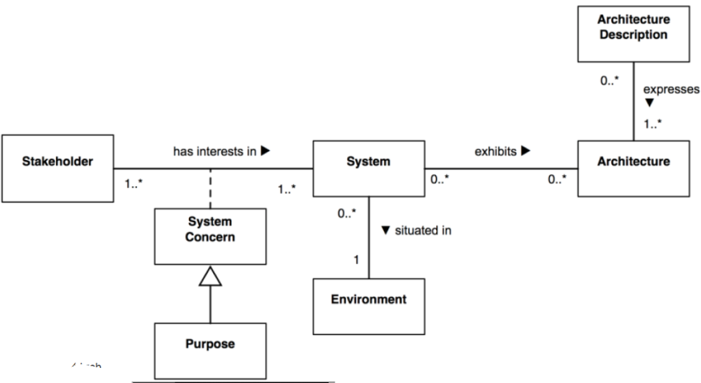

Core of Architecture Description
* The relations between content items when applying the Standard
* Produces an AD to express an Architecture for some System of Interest

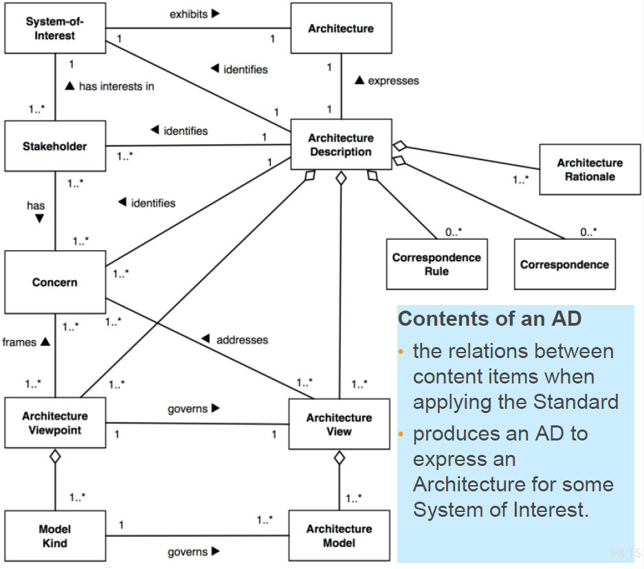

### ISO/IEC/IEEE 42010 Definition: Architecture
The fundamental concepts or properties of a system in its environment embodied in its elements, relationships, and in the principles of its design and evolution.
* In the standard architecture is abstract - not an artefact.
    * Architecture description: artefacts to express & document architectures
* What is fundamental to a system may take several forms:
    * Elements - the constituents that make up the system
    * relationship - both internal and external to the system; and
    * principles of its design and evolution
* Different architecture communities place varying emphases
    * Software architecture: focused on software components as elements and their interconnections as a key relationship
    * System architecture emphasizes sub-system structures and relationships such as allocation
    * Enterprise architecture emphasizes principles
# UML Views
## Why so Many Views and Diagrams
* Because so many different stakeholders are interested in the overall design == architecture.
* Viewpoints of the different stakeholders may lead to different views of the same system
    * These views have to be communicated and represented and then integrated
    * Together they form the complete architectural description of the software
* Architectural representation has two objectives
    * To be able to accommodate different views based on the requirements
    * Integrating of these different views to form the complete architectural representation
## RUP "4+1" View of Architectures
* "4+1" view model of Kruchten together with UML diagrams to use:
    * : Can also have Data View, Security View, etc


## Logical View (Module View)
* The logical view is concerned about the output(s) of the system and how it will affect the end users
* The logical view splits the system into a set of abstractions, or modules
* The decomposition serves two purposes:
    * It enables functional analysis
    * It helps an identification of common mechanisms and design elements that are common across the system
* Communication diagram:

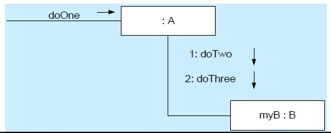
## Development View (Allocation View)
* This view describes the static organization of the software in its development environment
* It deals with modules, work allocation, costs and planning
* It also involves monitoring of project progress, software reuse and security.
* Component & Package Diagram:

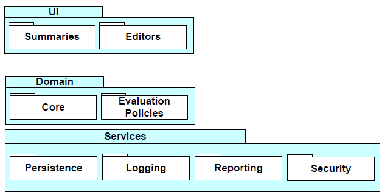
## Process View (Component-and-Connector View)
* This view deals with concurrency and distribution, system integrity, and fault tolerance
* It explains which components interact, and how they do so
* The dynamic connections between different components at runtime
* Activity diagram -> Flowchart

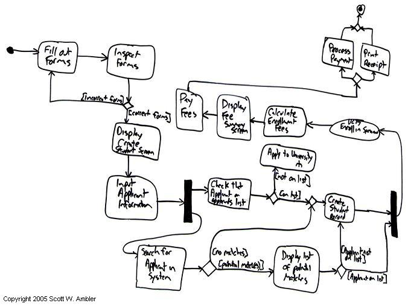

## Physical View (Deployment View)
* This view describes how the software maps onto the hardware
* It shows networking and distribution
* It considers system requirements like reliability and performance
* Deals with the elements identified in the previous three views
* Deployment Diagram


# UML Packages
* Packages group elements
    * For example, groups of classes in a single namespace
* Drawn as a rectangle with a smaller tab at the upper left
    * If members are shown within the package, name the tab
* Used to show the high level organization of a project
* A dashed arrow between packages indicates a dependency


## Logical Architecture
* Shows large-scale organization of software classes, grouped by
    * Layers (course-grained)
    * Packages
    * Subsystems (finer-grained)
        * Cohesive responsibility for a major aspect of the system
*  Logical -> Independent of actual deployment decisions
*  Seen notes:
    *  [Larman - Extractions from Chapter 13.pdf](docs/larman-extracts.pdf)
## Package Diagrams for Logical Architecture
* In UML logical partitioning is illustrated with package diagrams

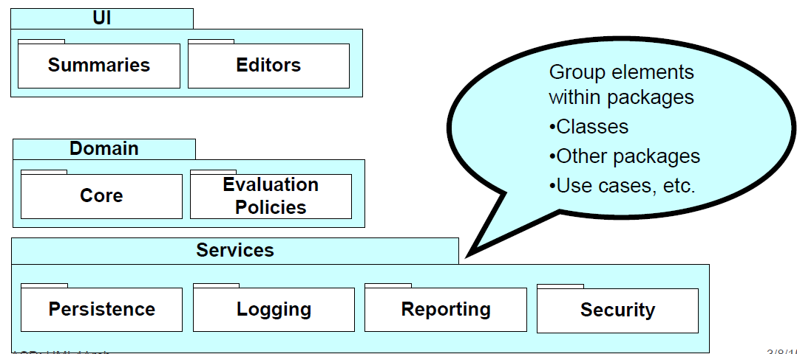

## Layers Shown with UML package diagram

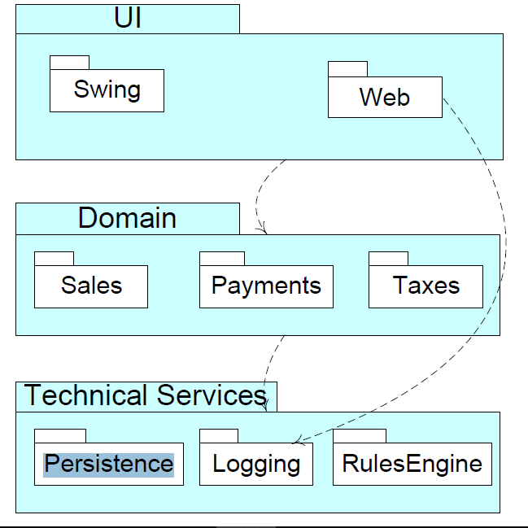

## Various UML notations for package nesting


We generally use the first notation

## Package Dependencies
* Dependency line indicates coupling of packages
    * Arrow points to the depended upon package
    * Implies change to depended upon package likely impacts dependent package
    * Robust architectures minimize dependencies

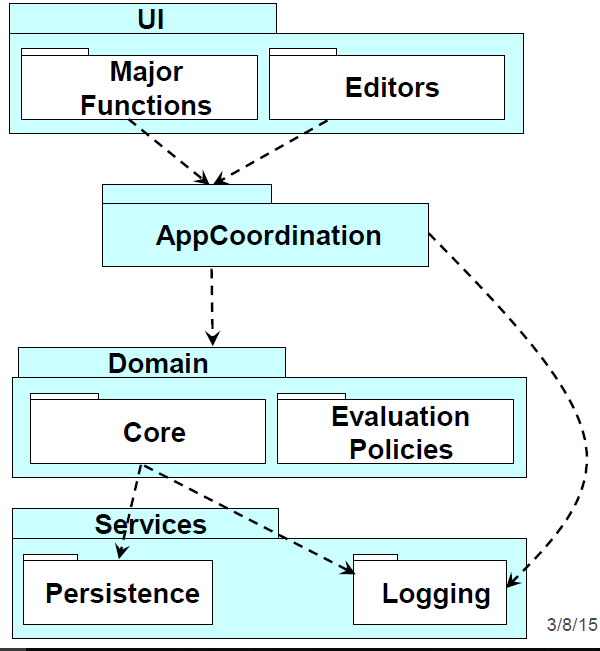

* When changing a package that has a dependency, you may need to consider the parts dependent on it as they may cause erroneous behaviour depending on the changes.
* So consider minimizing the dependencies on packages, as a change will lead to updating the package.

## Ordering Work
* What can we start with?
* What can we do in parallel?
* How?
    * Developers can work independently on different layers simultaneously
* This can make prototyping easier
    * You can hardcode some value in that will return something
## Type and Lollipop
* The `<<type>>` stereotype indicates that the class is an interface
> It has no member variables, and all of its member functions are pure virtual
* A shortcut for `<<type>>` classes is the *lollipop* notation to represent an interface
    * Shape depends on DrawingContext as shown by the dashed arrow (as usual)
    * The class WindowsDrawingContext is derived from, or conforms to, the DrawingContext interface


Where DrawingContext is as follows:

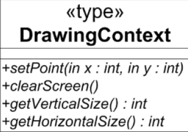

* Can use `<<interface>>` instead of `<<type>>`

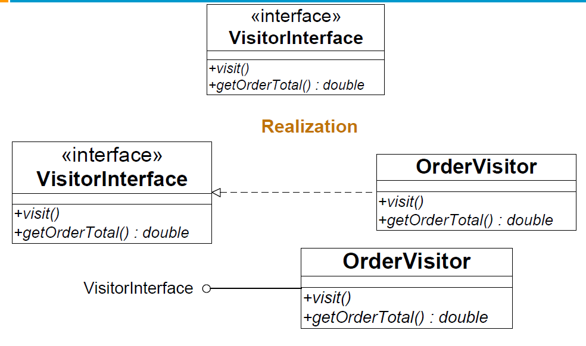

* Anything that implements the VisitorInterface has to use the `visit()` and `getOrderTotal()` method

> If you want a professional home entertainment system. You get a nice speaker system. If the speaker system breaks, you can simply unplug the broken one and plug in the working one -> because home entertainment systems have a standard interface.
## Components
### Design Level Perspective
* A component represents a modular part of a system that encapsulates its contents and whose manifestation is replaceable within its environment
    * Defines its behaviour in terms of provided and required interfaces
    * Servers as a *type* defined by these provided and required interfaces
    * Can be composed of multiple classes, or components
* Intent of using components is to emphasize
    * That the interfaces are important, and
    * It is modular, self-contained and replaceable
        * It is a *relatively* stand-alone module
* Components does not represent concrete software
    * Can map to concrete artefacts such as a set of files
### UML example
* At a large-grained level, a SQL database engine can be modelled as a component
> Any database that understands the same version of SQL and supports the same transaction semantics can be substituted
* At a finer grained level, any solution that implements the standard Java Message Service API can be used or replaced in a system


# Architecture Description
## Architecture Diagram
* The Architecture Diagram provides a graphical view of the major components in the system, and the relationships between them.
* Conceptual architecture diagram communicates with various stakeholders (e.g.: management, project managers for team/individual work assignments, developers and customers or users)
    * Provides a high-level view useful to non-technical audiences;
    * Summarizes the entire system for technical audiences
* Use any appropriate UML subset (even class diagrams)
* Remember the point is capturing and conveying the information; not providing the perfect UML
## Subscription-Based Sensor Collection Service (SBSCS)
* The *hello world* equivalent of an architecture description conforming to ISO/IEC 42010 - which you can find [here](http://www.iso-architecture.org/ieee-1471/docs/SBSCS-AD-v02.pdf)
* I downloaded the file, and the summary from the lecture slides - which you can find:
    * [SBSCS](docs/SBSCS.pdf)
    * [SBSCS Lecture Slides](docs/SBSCSLecture.pdf)
* Although, to summarize (some more) here is the a brief outline. There is a:
    * Architecture Description Identification, which contains the following information:
        * Version
        * Date of issue and status
        * Issuing organization
        * Change history
        * Summary
        * Scope
        * Context
        * Glossary
        * Results from evaluations
        * References
    * System Stakeholder and Concerns
        * Consider/Identify:
            * Users of the system
            * Operators of the system
            * Developers of the system
        * Outline the stakeholder and what concerns they have
    * There are three viewpoints: FVP, OVP and SVP
        * FVP - Financial Viewpoint
            * Shows ROI and justifies investment by the operator in project over time

        * OVP - Operational Viewpoint
            * Is used to show the required budgets of key operations to insure achieving timely delivery of data
        * SVP - System Viewpoint
            * Used to show overall data flow between system nodes
    * From those viewpoints you get the following views:
        * Financial view:
            * Profit statement
            * Profitability curve
            * 
        * Operational View
            * Timeline diagram
            * 
        *  System View
            *  Shows system nodes, dataflow between them
            *  Dataflow diagram
            *  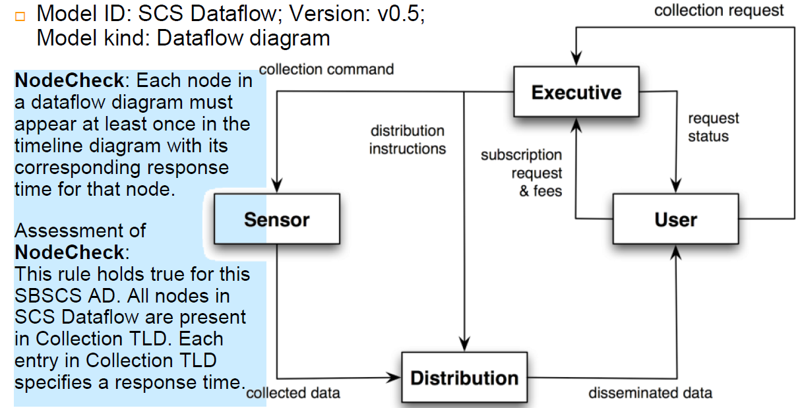
# Guidelines
## How to partition the domain model
* Place elements together that
    * Are in the same subject area - closely related by concept or purpose
    * Are in a class hierarchy together
    * Participate in the same use cases
    * Are strongly associated
## Architecture Analysis
* Start Architectural Analysis before the first cycle
    * Can start early iterations before architectural analysis is complete
* It is mainly concerned with non-functional requirements
    * *quality attributes* ([Bennet](docs/BennetChapter22.pdf))
    * e.g.: security
* Within the context of the functional requirements
    * E.g.: processing sales
* Examples of issues to be identified and resolved:
    * How do reliability and fault-tolerance requirements affect the design?
    * How do the licensing costs of purchased subcomponents affect profitability?
    * How do the the adaptability and configurability requirements affect the design?
## Common Steps in Architectural Analysis
1. Identify and Analyze the non-functional requirements that have an impact on the architecture
    * Architectural factors (or drivers)
2. For those requirements with a significant architectural impact, analyze alternatives and create solutions that resolve the impact
    * Architectural decisions
## Identification and analysis of architectural factors
* Quality Scenarios
    * Form: ```<stimulus> <measurable response>```
    * Record non-functional architectural factors in a measurable form
* Example:
    * When the completed sale is sent to the remote tax calculator to add the taxes, the result is returned within 2 seconds "most" of the time, measured in a production environment under "average" load conditions.
    * When a bug-report arrives from a test volunteer, reply with a phone call within 1 working day
* no point in describing scenarios that will never be tested before shipping
# Conclusion
* The basic architectural design principles are:
    * **Low couping**
    * **High Cohesion**
    * **Separation of concerns** and **localization of impact**
* One *could* design persistence support such that each object also communicated with a database to save its data
    * The concern of persistence is then mixed in with the concern of application logic
    * and same with security etc
> Cohesion drops and coupling rises
* Recommend: factor out persistence, security
    * Object with application just has application logic
    * Persistence subsystem focuses on the concern of persistence,
    * Security subsystem doesn't do persistence