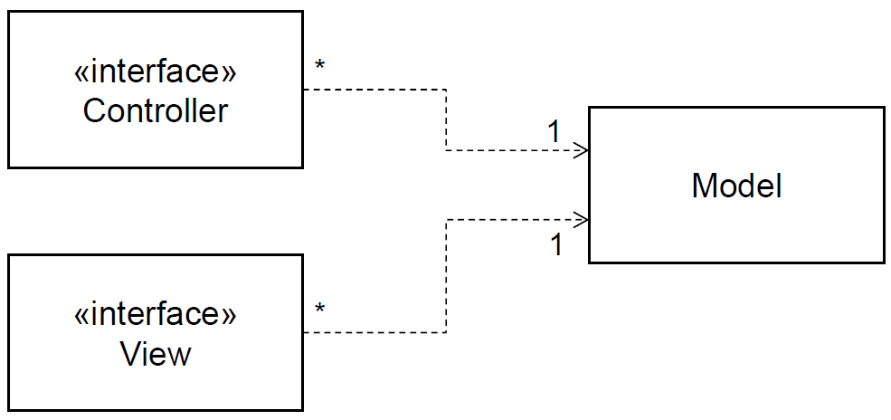
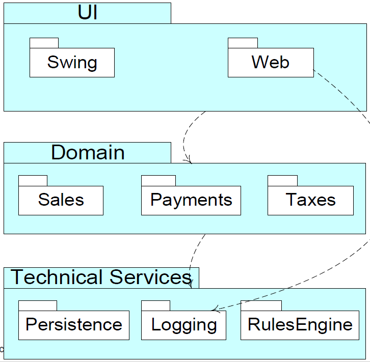
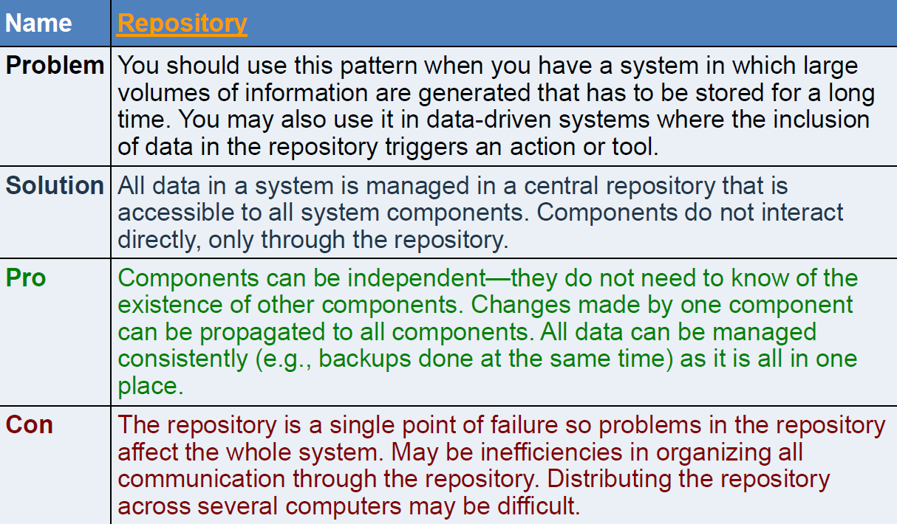
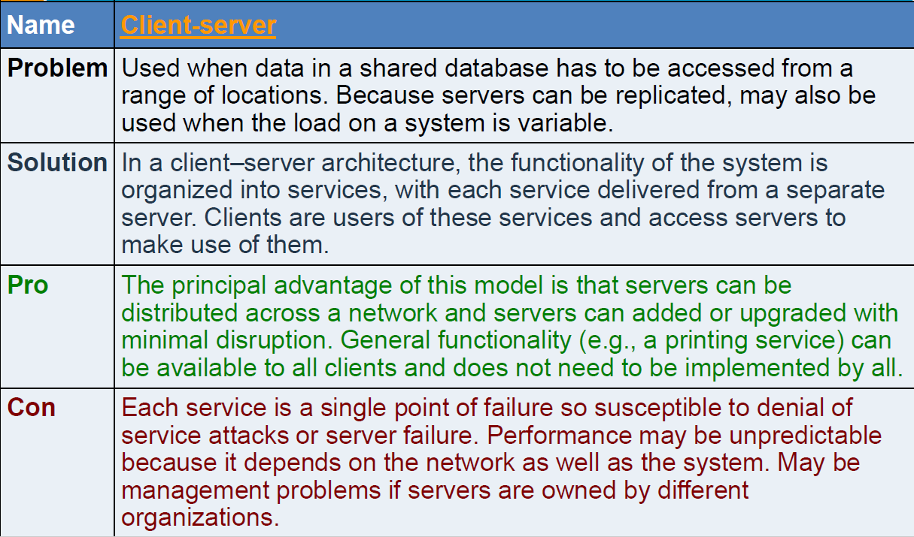
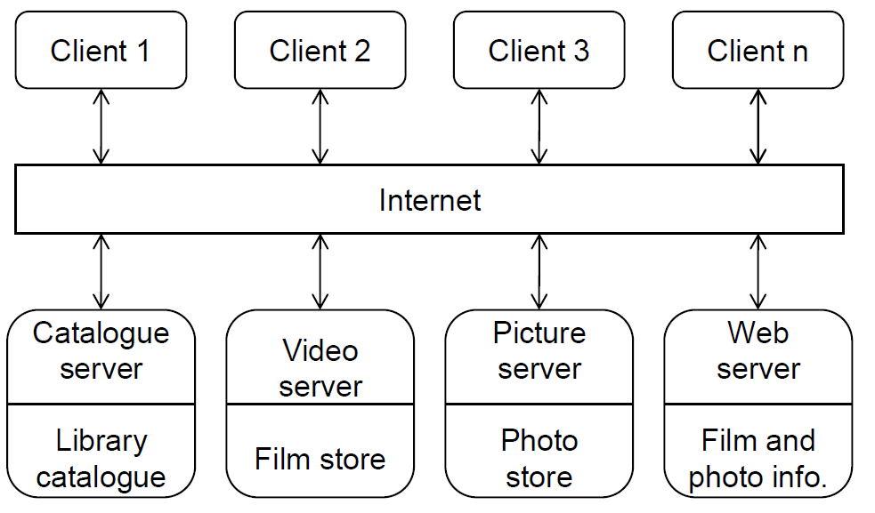
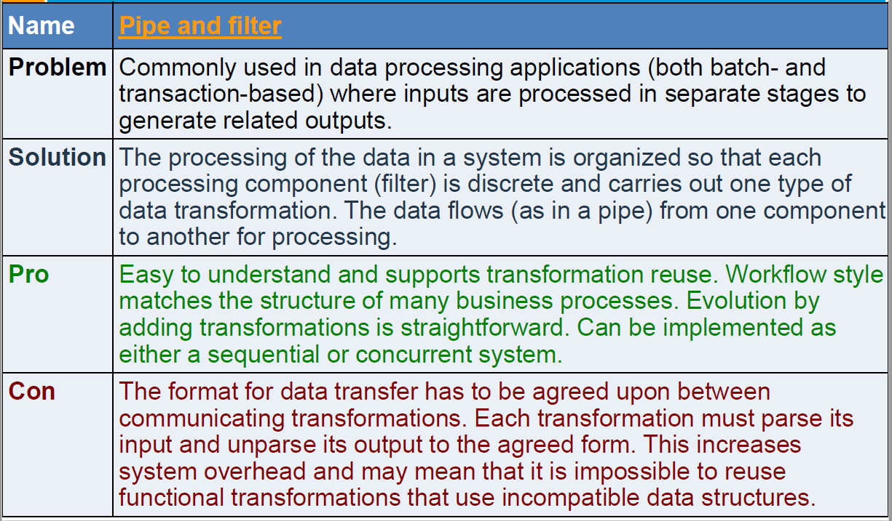

# Architecture & Patterns <!-- omit in toc -->
# Architecture Centred Approach
* We place an emphasis on design
    * Design pervades engineering activities
    * Important aspect of Computer Science
* An incorrect interpretation of the Agile Development leads to inadequate levels of architectural design information
* Architecture Decisions are system-wide Strategic Decisions
    * Choice of programming paradigm, e.g.: Object-orientation
    * Choose overall architectural pattern
    * Choice of API(S)
* Local detailed tactical decision e.g.: algorithms are left for later

## Requirements and Analysis leads to design

* At first we are investigators learning about a problem
* Then we change roles and become designers producing a working solution
* (and then we change back iteratively!)
## What is Software Architecture Then
* Software architecture -> *large scale*
    * big ideas
        * motivations
        * constraints
        * organisation
        * patterns
        * responsibilities
        * connections
    * Very interested in the non-functional requirements
        * also called quality requirements
        * e.g.: security, persistence, usability, etc
        * ensure that these can be met
        * or if cannot be met, suggest trade-offs
        * e.g.: trends vs costs vs time vs usability vs security
## Architecture is the Important Stuff
1. Expert developers understanding of the system design
2. The set of design decisions that must be made early on
    * Decisions that are hard to change
    * The important stuff 
        * Whatever that is
# Introducing Patterns
* Think about your own programming style
    * A large portion of it is most likely the way you structure your solutions, rather than the minute details of your code
    * If you could reuse the structure from one project to the next, you would gain all the benefits of reuse
* IT designer community has a growing body of past computer solutions for ideas and inspiration
* Best described using patterns
## Patterns are Encapsulated Experience
* Software design does not begin with an empty slate
* A new design is based on experience of previous 'similar' designs
* Software Design Patterns (SDP) attempt to guide new design with insight into typical problems
* They attempt to encapsulate the basic approaches for similar types of problems
## Patterns applied to Software Development
* The idea of named patterns for software originated with Kent Beck (eXtreme Programming guy) in the mid 1980s
* Software patterns really popularized with book:
    * *Design Patterns: Elements of Reusable Object-Oriented Software* by Gamma, Helm, Johnson, and Vlissides
        * Frequently referred to as the *Gang of Four* (GoF)
## Original Idea is from (real) Architecture
* Christopher Alexander, an architect, captured solutions to recurring problems
    * These problems and solutions were described as patterns
> Each pattern describes a problem that occurs over and over again in our environment and then describes the core of the solution to that problem in such a way that you can use this solution a million times over without ever doing it the same way twice
> Each pattern is a three-part rule, which expresses a relation between a certain context, a problem and a solution
* **Definition** a pattern is a solution to a problem in a context
## Real v Software Architecture
* Software is not embedded in space
    * Often no constraining physical laws
    * Software is (infinitely) malleable
* Software has no obvious representation
    * E.g.: no familiar geometric shapes
* Software does stuff - it is active
## Aims of Software Patterns
* The aim is to enhance reusability of object-oriented code
    * Well-structured object-oriented systems have recurring patterns of classes and objects
    * Knowledge of the patterns that have worked in the past allows
        * A designer to be more productive
        * The resulting designs to be more flexible and reusable
## Benefits of All Design Patterns
* Capture expertise and make it accessible to non-experts in an encapsulated design pattern
* Help communication amongst developers by providing a common language
    * Improve design understandably
* Make it easier to reuse successful designs and void alternatives that diminish reusability
* Facilitate design modifications
    * The design is more easily understood
* Improve design documentation
    * The system documentation starts with the UML design pattern
## Definition: Architectural Patterns
An *architectural pattern* is a set of architectural design decisions that are applicable to a recurring design problem, and parameterized to account for different software development contexts in which that problem appears.
* **Architecture Model**
    * An artefact documenting some or all of the architectural design decisions about a system
* **Architecture Visualization**
    * A way of depicting some or all of the architectural design decisions about a system to a stakeholder
* **Architecture View**
    * A subset of related architectural design decisions
# Key Architecture Patterns
## Model-View-Controller (MVC) Pattern
|  | Description |
|---|---|
|Problem|Used when there are multiple ways to view and interact with data. Also used when the future requirements for interaction and presentation of data are unknown |
|Solution|Separates presentation and interaction from the system data. The system is structure into three logical components that interact with each other. The Model component manages the system data and associated operations on the data. The View component defines and manages how the data is presented to the user. The Controller component manages user interactions (e.g.: key presses, mouse clicks, etc) and passes these interactions to the View and the Model|
|Pro|Allows the data to change independently of its representation and vice versa. Supports presentation of the same data in different ways with changes mode in on representation shown in all of them |
|Con| Can involve additional code and code complexity when the data model and interactions are simple |

## Layered Architecture Pattern
|  | Description |
|---|---|
|Problem | Used when building new facilities on top of existing systems; when the development is spread across several teams with each team responsibility for a layer of functionality; when there is a requirement for multi-level security.|
|Solution|Organises the system into layers with related functionality associated with each layer. A layer provides services to the layer above it so the lowest-level layers represent core services that are likely to be used throughout the system|
|Pro| Allows replacement of entire layers so long as the interface is maintained. Redundant facilities (e.g.: authentication) can be provided in each layer to increase the dependability of the system|
|Con|In practice, providing a clean separation between layers is often difficult and a high-level layer may have to interact directly with a lower-level layer rather than through the layer immediately below it. Performance can be a problem because of multiple levels of interpretation of a service request as it is processed at each layer|

## Repository Pattern

## Client-Server Pattern

## Pipe and Filter Pattern

## Key Aim of these Patterns
* Cohesion
    * Degree to which communication takes place within the module
* Coupling
    * Degree to which communication takes place between the modules
* Minimize coupling while maximising cohesion
# Layered Architecture
# Patterns and Concurrency
# Conclusion

# Resources
Sommerville:
* Chapter 6 *Architectural Design* <- important
    * [Architectural Patterns for Control](https://ifs.host.cs.st-andrews.ac.uk/Books/SE9/Web/Architecture/ArchPatterns/index.html)
    * [Application Architectures](https://ifs.host.cs.st-andrews.ac.uk/Books/SE9/Web/Architecture/AppArch/index.html)
    * [Reference Architectures](https://ifs.host.cs.st-andrews.ac.uk/Books/SE9/Web/Architecture/RefArch.html)
* Chapter 13 *Dependability Engineering* 
* Chapter 20 *Embedded Systems*
* Chapter 28 *Application Architectures* -> [Here](docs/SommervilleChapter28.pdf)

Bennet, McRobb & Farmer
* Chapter 13 *System Design and Architecture*
* Chapter 15 *Design Patterns* 

* Partha Kuchana, *Software Architecture Design Patterns in Java*
* Monroe, R.T., Kompanek, A., Melton, R., Garlan, D., *Architectural styles, design patterns and objects* -> [Here](https://ieeexplore.ieee.org/document/566427/)
* Mary Shaw. 1996. *Some patterns for software architectures*. In Pattern Languages od Program design 2. -> [Here](docs/PatternsForSoftwareArchitecture.pdf)