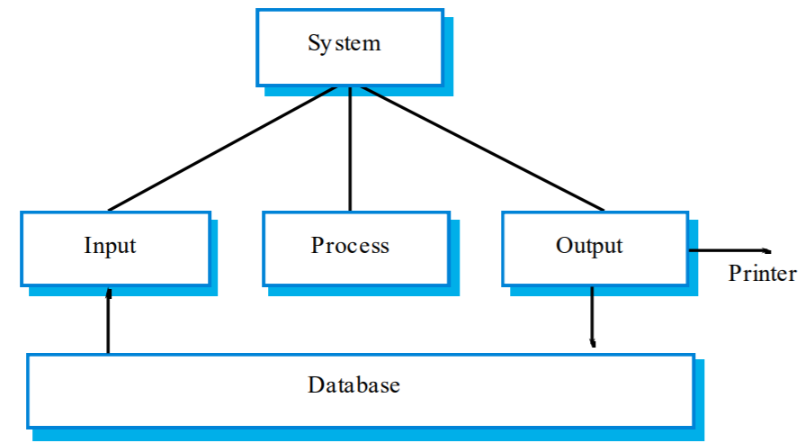
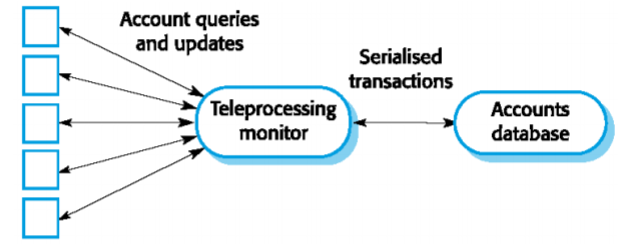
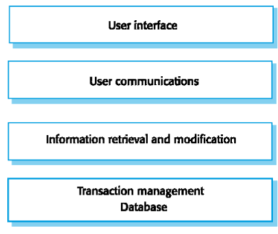
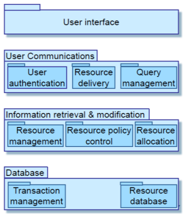
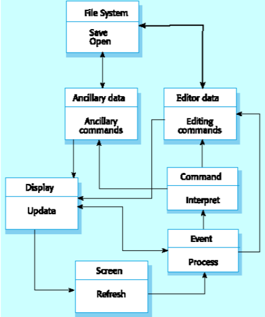

# Architecture & Applications <!-- omit in toc -->
- [Application Architectures](#application-architectures)
    - [Application Perspective](#application-perspective)
    - [Complex Applications](#complex-applications)
    - [Generic Application Architectures](#generic-application-architectures)
    - [Use of Application Architectures](#use-of-application-architectures)
    - [Application Types](#application-types)
- [Batch/Data Processing Systems](#batchdata-processing-systems)
    - [Input-process-output](#input-process-output)
- [Transaction Processing Systems](#transaction-processing-systems)
    - [Transaction processing middleware](#transaction-processing-middleware)
    - [Information Systems Architecture](#information-systems-architecture)
    - [Resource Allocation Systems](#resource-allocation-systems)
    - [Resource Allocation Architecture](#resource-allocation-architecture)
    - [E-Commerce System Architecture](#e-commerce-system-architecture)
- [Event Processing Systems](#event-processing-systems)
    - [Editing Systems](#editing-systems)
    - [Editing System Architecture](#editing-system-architecture)
    - [Information and Resource Management Systems](#information-and-resource-management-systems)
- [Language Processing Systems (Compilers)](#language-processing-systems-compilers)
    - [Language Processing Components](#language-processing-components)
- [Conclusion](#conclusion)
# Application Architectures
## Application Perspective
* So far had architectural perspectives on issues such as overall control, distribution and system structuring
* Now an alternative approach: architectures from an application perspective, i.e.: various application types
    * Two fundamental models of business systems
        * Batch processing
        * Transaction processing
    * Event processing systems
    * Language processing systems
## Complex Applications
* Follow a hybrid architectural model:
    * Different parts of the application structured in different ways
    * Different architecture models for individual subsystems
* Integrated within an overall system architecture
## Generic Application Architectures
* Application systems are designed to meet an organisational need
* As businesses have much in common, their application systems also tend to have a common architecture that reflects the application requirements
* A generic architecture is configured and adapted to create a system that meets specific requirements
## Use of Application Architectures
* As a starting point for architectural design
* As a design checklist
* As a way of organising the work of the development
* As a means of assessing components for reuse
* As a vocabulary for talking about application types
## Application Types
* Data Processing Applications
    * Data driven application that process data in branches without explicit user intervention during the processing
        * Billing systems; payroll systems
* Transaction processing applications
    * Data centred applications that process user requests and update information in a system database
        * E-commerce systems; reservation systems
* Event processing systems
    * Applications where system actions depend on interpreting events from the system's environment
        * Games; word processors; real-time systems
* Language processing systems
    * Applications where the users' intentions are specified in a formal language that is processed and interpreted by the system
        * Compilers, command interpreters
# Batch/Data Processing Systems
* Data-centred systems where the databases used are usually orders of magnitude larger than the software itself
* Data is input and output in batches
    * Input - a set of customer numbers and associated readings of an electricity meter
    * Output - a corresponding set of bills, one for each customer number
* Data processing systems usually have an `input->process->output` structure
## Input-process-output
* Input component reads data from a file or database, checks if validity and queues the valid data for processing
* Process component takes a transaction from the queue (input), performs computations and creates a new record with the results of the computation
* Output component reads these records, formats them accordingly and writes them to the database or sends them to a printer

# Transaction Processing Systems
* Process user requests for information from a database or or requests to update the the database
* From a user perspective a transaction is:
    * Any coherent sequence of operations that satisfies a goal
    * For example - find the times of flight from London to Paris
* Users make asynchronous requests for service which are then processed by a transaction manager

## Transaction processing middleware
* Transaction management middleware or teleprocessing monitors handle communications with different terminal types (e.g.: ATMs and counter terminals), serialises data and sends it for processing
* Query processing takes place in the system database and results are sent back through the transaction manager to the user's terminal

## Information Systems Architecture
* Information systems have a generic architecture that can be organised as a **layered architecture**
* Layers include
    * The user interface
    * User communications
    * Information retrieval
    * System database

## Resource Allocation Systems
* Systems that manage a fixed amount of some resource (football game tickets, books in a bookshop, etc) and allocate this to users
* Example of resource allocation systems
    * Timetabling systems where the resource being allocated is a time period
    * Library systems where the resource being managed is books and other items for loan
    * Air traffic control systems where the resource being managed is the airspace
## Resource Allocation Architecture
* Resource allocation systems are layered systems that include
    * A resource database
    * A rule set describing how resources are allocated
    * A resource manager
    * A resource allocator
    * User authentication
    * Query management
    * Resource delivery component
    * User interface

## E-Commerce System Architecture
* E-commerce systems are Internet-based resource management systems that accept electronic orders for goods or services
* Usually organised using a multi-tier architecture with application layers associated with each tier

# Event Processing Systems
* These systems respond to events in the system's environment
* Their key characteristics is that event timing is unpredictable so the architecture has to be organised to handle this
* Many common systems such as word processors, games, etc. are event processing systems
## Editing Systems
* Common type of event processing system
* Editing system characteristics
    * Single user systems
    * Must provide rapid feedback to user actions
    * Organised around long transactions so may include recovery facilities
## Editing System Architecture
* Editing systems are naturally object-oriented
    * Screen - monitors screen memory and detects events
    * Event - recognises events and passes them for processing
    * Command - executes a user command
    * Editor data - manages the editor data structure
    * Ancillary data - manages other data such as styles & preferences
    * File system - manages file I/O
    * Display - updates the screen display

## Information and Resource Management Systems
# Language Processing Systems (Compilers)
* Input a natural or artificial language and generate another representation
    * Programming language to machine code
* May interpret code and execute it
* Used when the easiest way to solve a problem is implement an algorithm
* Als used for domain-specific languages
    * What is that?
![Language Processing Systems]  (img/languageprocessingsystem.png)
## Language Processing Components
* Lexical analyser (tokenizer, scanner) - produces tokens: the words in the language, e.g.: variable names, operators, etc,
* Symbol table - stores the words
* Syntax analyser - parses tokens to produce a syntax tree, checks that tokens conform to the rules of the language
* Syntax tree - stores the program
* Semantic analyser - check aspects not related to syntactic form, e.g.: type correctness
* Code generator - transform and optimise the syntax tree into instructions for the target machine
    * Can think of it as a python filter process

Can also think of it as a Repository model of a compiler, where the repository handles the syntax definition and symbol table, output definition etc - as follows:

# Conclusion
* Generic models of application architectures help us understand and compare applications
* Important classes of application are data processing systems, transaction processing systems, event processing systems and language processing system
    * Or a combination
* Data processing systems operate in batch mode and have an `input -> process -> output structure`.
* Transaction processing systems allow information in a database to be remotely accessed and modified by multiple users
* Event processing systems respond to events in the environment
* Language processing systems translate texts from one language to another and may interpret the specified instructions
* Typescript -> Javascript