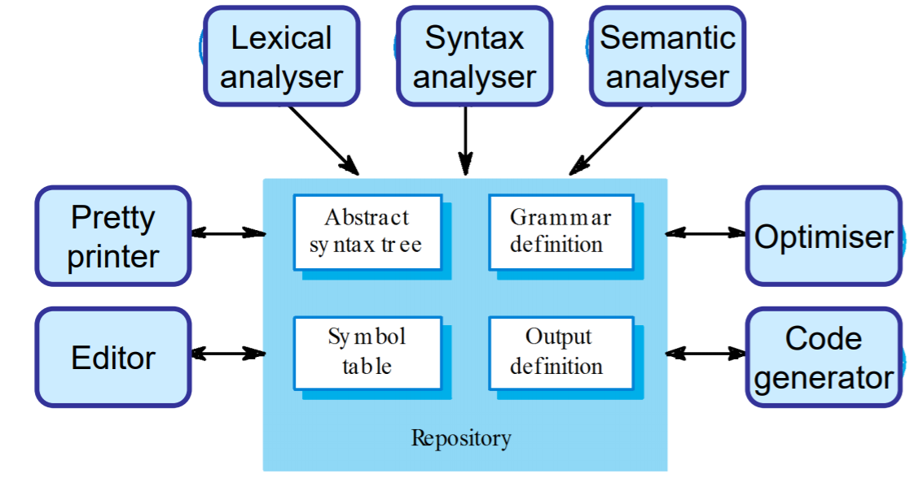

# Application Architectures
## Application Perspective
* So far had architectural perspectives on issues such as overall control, distribution and system structuring
* Now an alternative approach: architectures from an application perspective, i.e.: various application types
    * Two fundamental models of business systems
        * Batch processing
        * Transaction processing
    * Event processing systems
    * Language processing systems
## Complex Applications
* Follow a hybrid architectural model:
    * Different parts of the application structured in different ways
    * Different architecture models for individual subsystems
* Integrated within an overall system architecture
## Generic Application Architectures
* Application systems are designed to meet an organisational need
* As businesses have much in common, their application systems also tend to have a common architecture that reflects the application requirements
* A generic architecture is configured and adapted to create a system that meets specific requirements
## Use of Application Architectures
* As a starting point for architectural design
* As a design checklist
* As a way of organising the work of the development
* As a means of assessing components for reuse
* As a vocabulary for talking about application types
## Application Types
* Data Processing Applications
    * Data driven application that process data in branches without explicit user intervention during the processing
        * Billing systems; payroll systems
* Transaction processing applications
    * Data centred applications that process user requests and update information

# Batch/Data Processing Systems
# Transaction Processing Systems
## Information and Resource Management Systems
# Event Processing Systems
# Language Processing Systems (Compilers)
* Input a natural or artificial language and generate another representation
    * Programming language to machine code
* May interpret code and execute it
* Used when the easiest way to solve a problem is implement an algorithm
* Als used for domain-specific languages
    * What is that?

## Language Processing Components
* Lexical analyser (tokenizer, scanner) - produces tokens: the words in the language, e.g.: variable names, operators, etc,
* Symbol table - stores the words
* Syntax analyser - parses tokens to produce a syntax tree, checks that tokens conform to the rules of the language
* Syntax tree - stores the program
* Semantic analyser - check aspects not related to syntactic form, e.g.: type correctness
* Code generator - transform and optimise the syntax tree into instructions for the target machine
    * Can think of it as a python filter process

Can also think of it as a Repository model of a compiler, where the repository handles the syntax definition and symbol table, output definition etc - as follows:

# Conclusion
* Generic models of application architectures help us understand and compare applications
* Important classes of application are data processing systems, transaction processing systems, event processing systems and language processing system
    * Or a combination
* Data processing systems operate in batch mode and have an `input -> process -> output structure`.
* Transaction processing systems allow information in a database to be remotely accessed and modified by multiple users
* Event processing systems respond to events in the environment
* Language processing systems translate texts from one language to another and may interpret the specified instructions
* Typescript -> Javascript