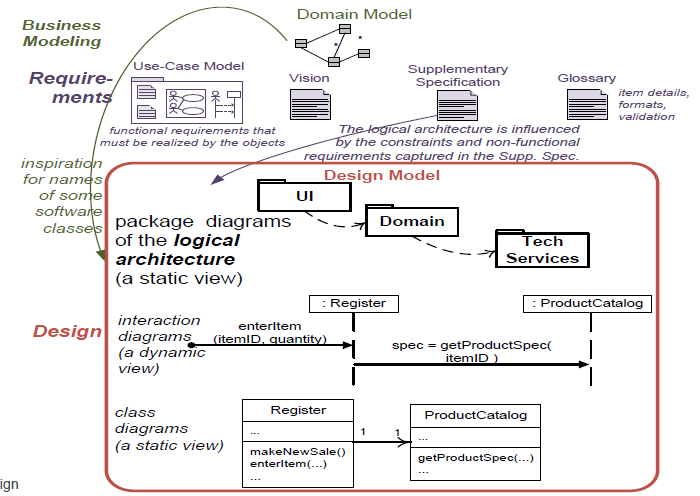
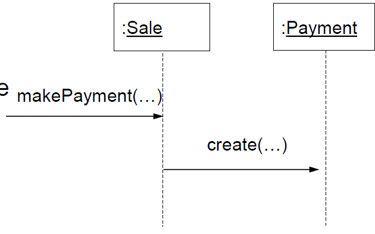
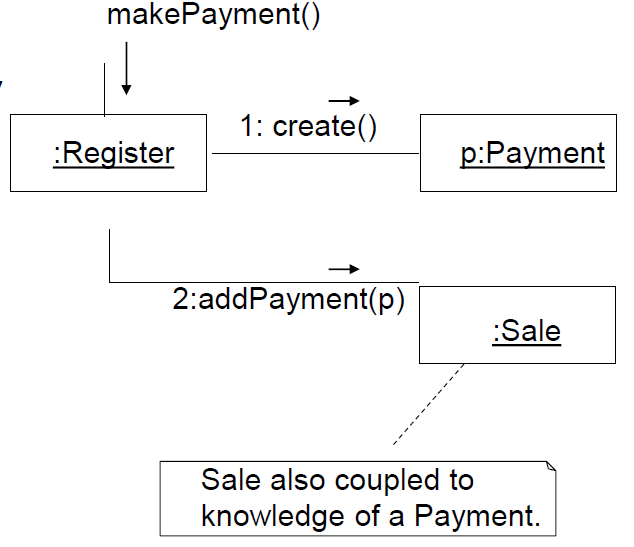
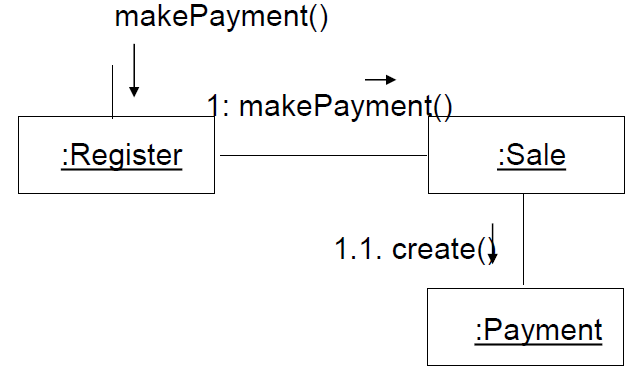
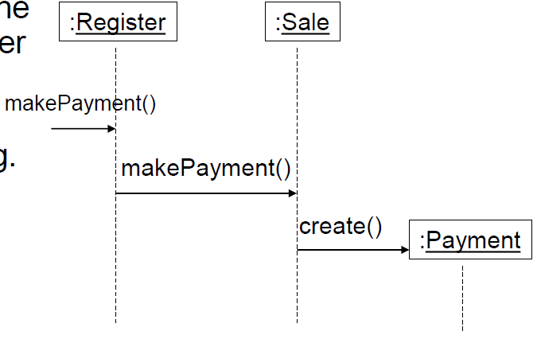
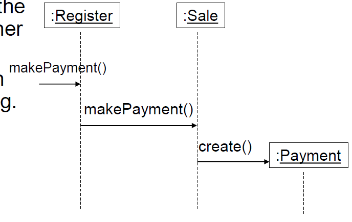
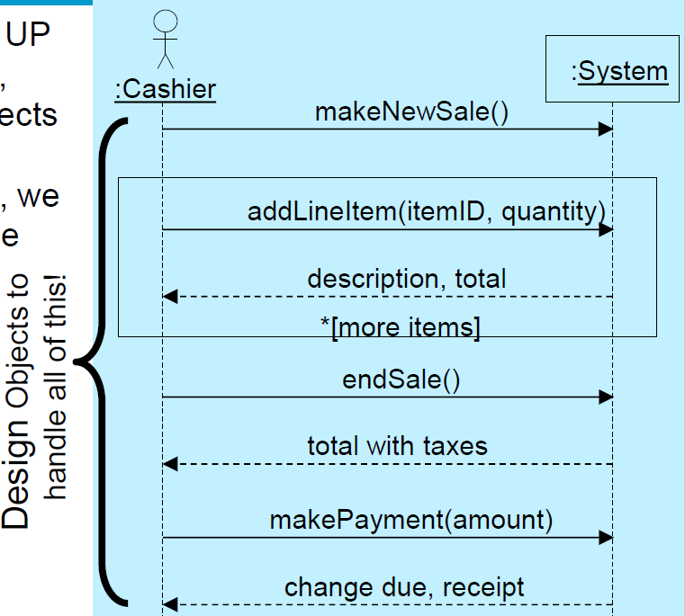
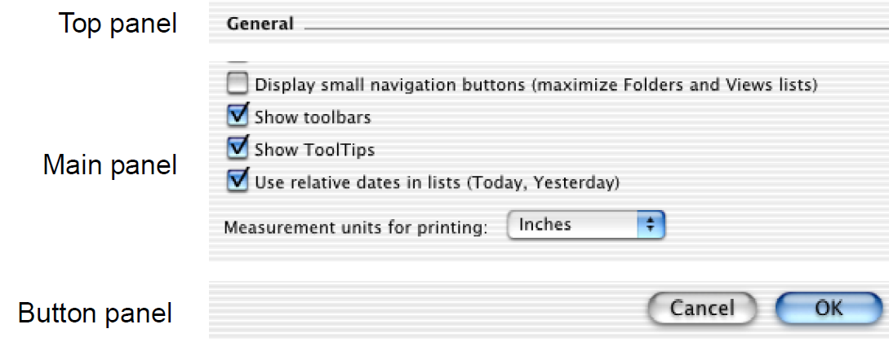
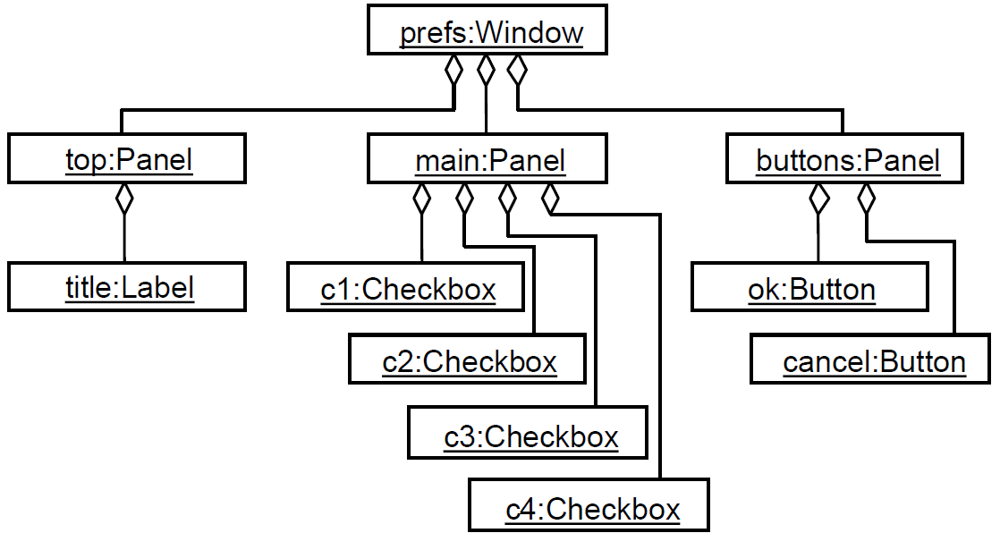

# Design Patterns <!-- omit in toc -->
- [Design Patterns](#design-patterns)
    - [Class Design and Unified Process Terminology](#class-design-and-unified-process-terminology)
    - [Domain Model versus Design Model](#domain-model-versus-design-model)
    - [Sample UP Artefact Relationships](#sample-up-artefact-relationships)
- [Responsibility-Drive Design](#responsibility-drive-design)
    - [Responsibilities and Methods](#responsibilities-and-methods)
    - [RDD and Collaboration](#rdd-and-collaboration)
    - [Definition: Responsibilities](#definition-responsibilities)
    - [Responsibilities and System Sequence Diagrams](#responsibilities-and-system-sequence-diagrams)
- [GRASP](#grasp)
    - [Patterns](#patterns)
        - [Four elements of Pattern Templates](#four-elements-of-pattern-templates)
    - [Nine Grasp Patterns (+ 2)](#nine-grasp-patterns--2)
        - [Information Expert](#information-expert)
        - [Creator](#creator)
        - [Controller](#controller)
        - [Low Coupling](#low-coupling)
        - [High Cohesion](#high-cohesion)
        - [Coupling and Cohesion](#coupling-and-cohesion)
        - [Polymorphism](#polymorphism)
        - [Pure Fabrication](#pure-fabrication)
        - [Indirection](#indirection)
        - [Protected Variation](#protected-variation)
        - [Don't Talk to Strangers](#dont-talk-to-strangers)
- [Use Case Realizations](#use-case-realizations)
    - [Definition](#definition)
    - [Designing for Visibility](#designing-for-visibility)
- [GoF Patterns](#gof-patterns)
    - [Singleton Pattern](#singleton-pattern)
    - [Composite Pattern](#composite-pattern)
        - [Anatomy of a preference dialog](#anatomy-of-a-preference-dialog)
        - [UML Object diagram for UI Preference](#uml-object-diagram-for-ui-preference)
    - [Applying Composite Pattern to UI Widgets](#applying-composite-pattern-to-ui-widgets)
    - [Facade Pattern](#facade-pattern)
    - [Observer Pattern](#observer-pattern)
    - [Designing for Low Representational Gap](#designing-for-low-representational-gap)
- [Conclusion](#conclusion)
    - [Summary](#summary)
- [Resources](#resources)
# Design Patterns
## Class Design and Unified Process Terminology
* UP = Unified Process
* Typical information in a Design Class Diagram includes:
    * Classes, associations and attributes
    * Interfaces (with operations and constants)
    * Methods
    * Attribute type information
    * Navigability
    * Dependencies
* The Class Design depends upon the Domain Model and interaction diagram
* The UP defines a Design Model which includes interaction and class diagrams
## Domain Model versus Design Model
* Domain Model is the analysis class diagram
* Don't show methods

* Design Model shows methods and visibility (arrowhead on association)
* Register has reference to Sale; Sale des not have reference to Register

## Sample UP Artefact Relationships

# Responsibility-Drive Design
* RDD: software objects have responsibilities (an abstraction)
    * a `Sale` is responsible for creating `SalesLineItems` (doing)
    * a `Sale` is responsible for knowing its `total` (knowing)
* Metaphor for thinking about OO design
* Big responsibilities take lots of classes and methods
    * "provide access to relational database"
        * Subsystem with 100 classes and 1000 methods
* Small responsibilities may take one method
    * "Create a sale" - one method in one class
* A responsibility is not a method, but methods fulfil responsibilities
## Responsibilities and Methods
> Object design is about identifying classes and objects, and their methods, and how they interact.
* Responsibilities relate to the obligations of an object
* Two types of responsibilities
    * Doing
        * Doing something itself (e.g.: creating an object, doing a calculation)
        * Initiating action in other objects
        * Controlling and coordinating activities in other objects
    * Knowing
        * Knowing about private encapsulated data
        * Knowing about related objects
        * Knowing about things it can derive or calculate
## RDD and Collaboration
* Responsibilities are implemented with methods that either act alone or collaborate with other methods and objects.
    * The `Sale` class might define one or more methods to know its total; say, a method named `getTotal`
    * The `Sale` may collaborate with other projects, such as sending a `getSubTotal` message to each `SalesLineItem` object asking for its subtotal
## Definition: Responsibilities
* Responsibilities are an abstraction
    * The responsibility for persistence
        * Large-grained responsibility
    * The responsibility for the sales tax calculation
        * More fine-grained responsibility
* Responsibilities are implemented with methods in objects
    * 1 method in 1 object
    * 5 methods in 1 object
    * 50 methods across 10 objects
## Responsibilities and System Sequence Diagrams
* Within the analysis artefacts, a common context where these responsibilities (implemented as methods) are considered is during the creation of sequence diagrams
* Sale objects have been given the responsibility to create Payments, handled with the makePayment method

# GRASP
I don't quite *GRASP* this section :wink:

* Design Objects with Responsibilities
    * A critical skill is designing or thinking in objects
    * This *can* be practiced based on explainable principles
* Question: What guiding principles to help us assign responsibilities?
    * One answer:
    * **G**eneral **R**esponsibility **A**ssignment **S**oftware **P**atterns - **GRASP**
        * Very fundamental, basic principles of object design
        * Patterns are named problem-solution pairs to common problems, typically showing a popular, robust solution
            * "Facade", "Information Expert"
        * They provide a *vocabulary* of design
## Patterns
* Principles (expressed in patterns) guide choices about where to assign responsibilities
* A pattern is a named **description of a problem** and a **solution** that can be applied to new contexts;
    * it provides advice on how to apply it in varying circumstances
* For example:
    * **Pattern name**: Information Expert
    * **Problem**: What is the most basic principle by which to assign responsibilities to objects?
    * **Solution**: Assign a responsibility to the class that has the information needed to fulfil it
### Four elements of Pattern Templates
* Name
    * Increases our vocabulary
    * Frequently see "Also Known As", AKA
        * Indication of a naming problem
* Problem
    * Describes problem, inherent trade-offs and context
* Solution
    * General description of how to solve the problem
        * abstraction of an entire family of similar solutions
* Consequences - usually required
    * Each solution has trade-off and consequences
    * Solutions can cause or amplify other problems
        * Costs and benefits should be compared against
## Nine Grasp Patterns (+ 2)
1. Information Expert (expert)
2. Creator
3. Controller
4. Low Coupling
5. High Cohesion
6. Polymorphism
7. Pure fabrication
8. Indirection
9. Protected Variations (don't talk to strangers)
### Information Expert
AKA - Expert
* What is most basic, general principle of responsibility assignment?
> Assign a responsibility to the information expert - the class that has the information necessary to fulfil the responsibility
* "That which has the information, does the work"

**Example**
* What software object calculates sales total?
    * What information is needed to do this?
    * What object or objects hsa the majority of this information

Answer:
* It is necessary to know about all the `SalesLineItem` instances of a sale and the sum of the subtotals
* A Sale instance contains these, i.e. it is an *information expert* for this responsibility

Definition continued:
* To fulfil the responsibility of knowing and answering the sale's total, three responsibilities were assigned to three design classes
* The fulfilment of a responsibility often requires information that is spread across different classes of objects. This implies that there are many *partial experts* who collaborate in the task.

|Class|Responsibility|
|---|---|
|`Sale`|Knows Sale total|
|`SalesLineItem`|Knows line item total|
|`ProductSpecification`|Knows product price|

### Creator
* **Problem**: Who should be responsible for creating a new instance of some class?
* **Solution**: Assign class C the responsibility to create an instance of class X if one or more of the following is true:
    * C aggregates X objects
    * C contains X objects
    * C records instances of X objects
    * C closely uses X
    * C has the initializing data that will be passed to X when it is created (thus C is an Expert with respect to creating X)
* The more the better

**Example**
* In the POS application, who should be responsible for creating a `SalesLineItem` instance?
* Since a `Sale` contains many `SaleLineItem` objects, the `Creator` pattern suggests that `Sale` is a good candidate.

### Controller
* What object in the domain (or application coordination layer) receives the requests for work from the UI layer?
* Solution: Choose a class whose name suggests:
    * The overall "system", device or subsystem
        * A kind of facade class
    * Or, represents the use case scenario or session
* **Problem**: Who should be responsible for handling an input system event?
* **Solution**: Assign the responsibility for receiving or handling a system event message to a class representing one of the following choices:
    * Represents the overall system
    * Represents a use case scenario
    * A Controller is a non-user interface object that defines the method for the system operation
        * Note that windows, applets, etc. Typically receive events and delegate them to a controller
### Low Coupling
* Coupling: it is a measure of how strongly one element is connected to, has knowledge of, or relies upon other elements
* A class with high coupling depends on many other classes (libraries, tools)
* Problems because of high coupling:
    * Changes in related classes force local changes
    * Harder to understand in isolation; need to understand other classes
    * Harder to reuse because it requires additional presence of other classes
* **Problem**: How to support low dependency, low change impact and increased reuse?
* **Solution**: Assign a responsibility so that coupling remains low

**Example**
* Assume we need to create a `Payment` instance and associate it with the `Sale`.
* What class should be responsible for this? 
* By `Creator`, `Register` is a candidate
* `Register` could then send an `addPayment` message to `Sale`, passing along the new `Payment` as a parameter
* The assignment of responsibilities couples the `Register` class to knowledge of the `Payment` class

* An alternative solution is to create `Payment` and associate it with the `Sale`
* No coupling between `Register` and `Payment`

* Some of the places where coupling occurs:
    * Attributes: X has an attribute that refers to a Y instance
    * Methods: e.g.: a parameter or a local variable of type Y is found in a method of X
    * Subclasses: X is a subclass of Y
    * Types: X implements interface Y 
* There is no specific measurement for coupling, but in general, classes that are generic and simple to reuse have low coupling.
* There will always be some coupling among objects, otherwise, there would be no collaboration

### High Cohesion
* Cohesion: it is a measure of how strongly related and focused the responsibilities of an element are.
* A class with low cohesion does many unrelated activities or does too much work
* Problems because of a design with low cohesion:
    * Hard to understand
    * Hard to reuse
    * Hard to maintain
    * Delicate, affected by change
* **Problem**: How to keep complexity manageable?
* **Solution**: Assign a responsibility so that cohesion remains high

**Example**
* Assume we need to create a Payment instance and associate it with Sale. What class should be responsible for this?
* By Creator, Register is a candidate.
* Register may become bloated if it is assigned more and more system operations.

* An alternative design delegates the Payment creation responsibility to the Sale, which supports higher cohesion in the Register
* The design supports high cohesion and low coupling.

  
* Scenarios that illustrate varying degrees of functional cohesion
* Very low cohesion: class responsible for many things in many different areas
    * e.g.: a class responsible for interfacing with a database and remote-procedure-calls
* Low cohesion: class responsible for complex task in a functional area
    * e.g.: a class responsible for interacting with a relational database
* High Cohesion: class has moderate responsibility in one functional area and it collaborates with other classes to fulfil a task
    * E.g.: a class responsible for one section of interfacing with a database
* Rule of thumb: a class with high cohesion has a relative low number of methods, with highly related functionality, and doesn't do much work. It collaborates and delegates.

### Coupling and Cohesion
* High Cohesion typically implies Low Coupling
* Low Cohesion typically implies low coupling

### Polymorphism
* **Problem**: How to design for varying, similar cases?
* **Solution**: Assign a polymorphic operation to the family of classes for which the cases vary
* E.g.: draw() which can be called for various shapes
    * Square, Circle, Triangle

### Pure Fabrication
* **Problem**: Where to assign a responsibility, when the usual options based on Expert lead to problems with coupling and cohesion, or are otherwise undesirable?
* **Solution**: Make up an *artificial* class, whose name is not necessarily inspired by the domain vocabulary
* E.g.: in Register-Sales-Payment Example
    * ReceiptPrinter
### Indirection
* **Problem**: A common mechanism to reduce coupling?
* **Solution**: Assign a responsibility to an intermediate object to decouple collaboration from 2 other objects
### Protected Variation
* "Information Hiding"
* **Problem**: How to design objects so that changes in these objects do not have side effects on other objects
* **Solution**: Put a wrapper or interface object around them. The wrapper gives a stable interface and is all that has to be altered when the changes happen
### Don't Talk to Strangers
* Special case of *Protected Variation*
* In a method, only send messages to "familiars":
1. This or self
2. Parameters
3. Own attributes (including elements of collections)
4. Object created in the method (local)

In other words don't go down a chain of links to indirectly known "strangers". This avoids coupling to distant objects.

* **Problem**: how to pass messages and ensure their security?
* **Solution**: don't pass messages in a way that may allow insecurity...(?)
# Use Case Realizations
This section wasn't covered in a large amount of depth
## Definition
* In the vocabulary of the Unified Process and use case modelling, when we design the objects to handle the system's operation for a scenario, we are designing a use case realization

## Designing for Visibility
* Fact: To send a message to B, A must have visibility to B. It doesn't happen by "magic"
* Not a GRASP pattern but important!
* Kinds of visibility
    * Attribute (instance variable)
    * Parameter
    * Local Variable
    * Global Variable
# GoF Patterns
Reference to the [book](https://en.wikipedia.org/wiki/Design_Patterns) *Design Patterns: Elements of Reusable Object-Oriented Software* written by Erich Gamma, John Vlissides, Ralph Johnson, and Richard Helm -who were commonly referred to as the *Gang of Four* or **GoF**
## Singleton Pattern
* Ensures a class only has one instance, and provide a global point of access to it
    * Sometimes we want just a single instance of a class to exist in the system
        * Want just one window manager, or one factory for a family of products
        * Need to have that instance easily accessible and we want to ensure that additional instances of the class cannot be created
    * Benefits
        * Controlled access to sole instance
> Ensure a class has one instance, and provide a global point of access to it

`-` GoF

Only one instance of a certain class *never* two. Structure for a unique object or sub-system

## Composite Pattern
* **Problem**: Application needs to manipulate hierarchical collection of "primitive" and "composite" objects uniformly
* **Solution**: Define an abstract base class (`Component`) that specifies the behaviour that needs to be exercised uniformly across all primitive and composite objects. Subclass the Primitive and Composite classes off of the `Component` class. Each Composite object "couples" itself only to the abstract type `Component` as it manages its "children"

### Anatomy of a preference dialog
* Aggregates (Composites), called Panels, are used for grouping user interface objects that need to be resized and moved together.

### UML Object diagram for UI Preference

## Applying Composite Pattern to UI Widgets
*  The Swing Component hierarchy is a Composite
    *  Leaf widgets (e.g.: Checkbox, Button, Label) specialize the component interface
## Facade Pattern
* Define a single point of contact to the subsystem - a facade object that wraps the subsystem. 

## Observer Pattern
* Generalization of the MVC pattern
    * Want to display data in more than one form at the same time and have all of the displays reflect any changes in that data
* Assumes the object containing the data is separate from the objects which display the data,
    * These display objects observe changes in that data
* Liabilities/Concerns
    * Possible cascading of notifications
    * Observers are not aware of each other and must be careful about triggering updates
    * Simple update interface requires observers to deduce changed item
## Designing for Low Representational Gap
* Normally we design for a low representational gap between real world and software
* Typically designed objects typically correspond to real world objects
* But (contra-indication):
    * Don't design for low representational gap regarding actors
    * E.g.: we don't make a software class Clerk do all the work in the software system
* Exercise: why?
    * Actors do more than one specific class
    * It may be sensible to talk about one specific actor
    * Separating it out into multiple classes
# Conclusion
## Summary
* Principles (expressed in *patterns*) guide choices in where to assign responsibilities
* A *pattern* is a named description of a problem and a solution that can be applied to new contexts;
    * It provides advice on how to apply it in varying circumstances
# Resources
* GRASP (General Responsibility Assignment Software Patterns)
    * Larman
        * 2nd Edition
            * Chapter 16
            * Chapter 17 & 22
        * 3rd Edition
            * Chapter 17 <- main interest
            * Chapter 18 & 25
* GoF (Gang-of-Four)
    * Larman
        * 2nd Edition
            * Chapter 23,33 & 34
        * 3rd Edition
            * Chapter 26, 36 & 37  