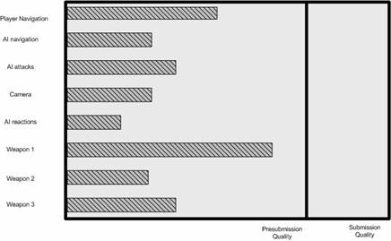
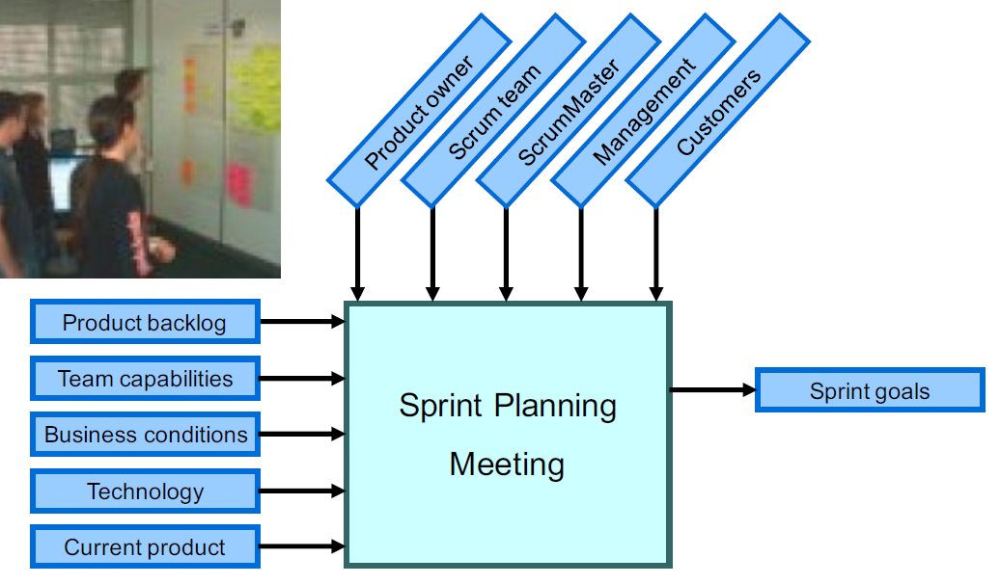
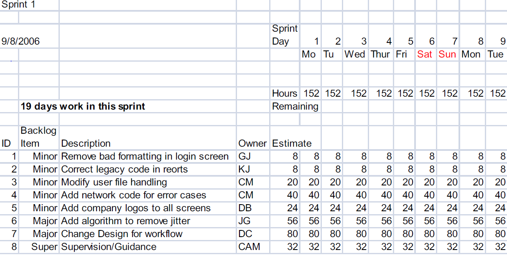
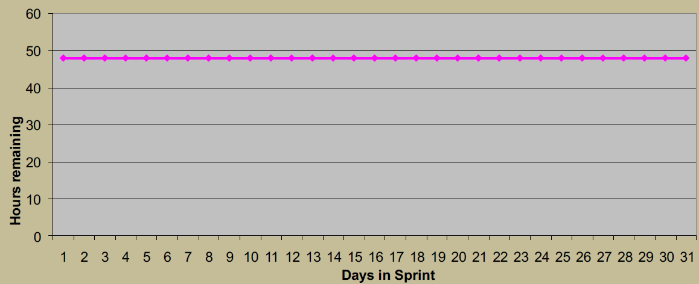
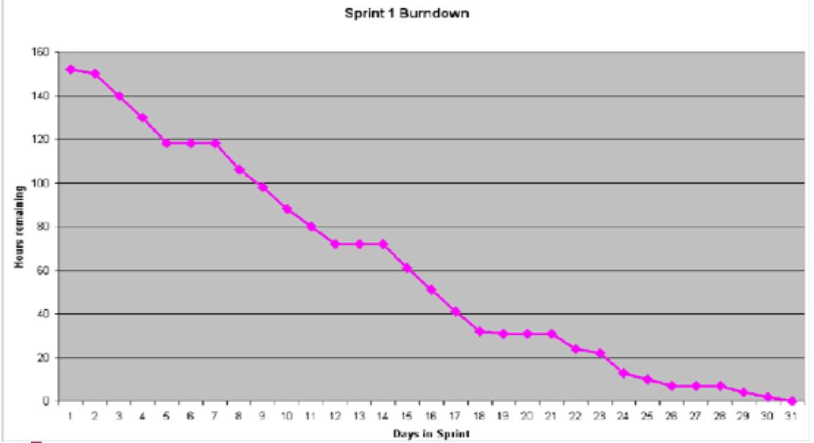
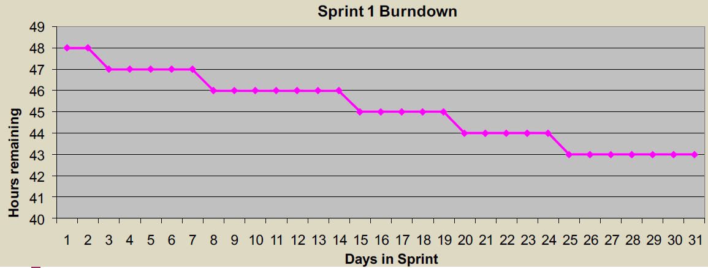
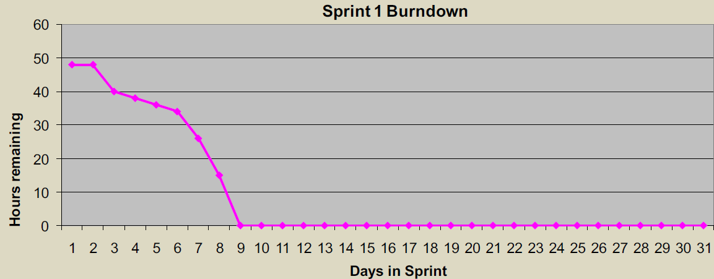

# Scrum  <!-- omit in toc -->
- [Introduction](#introduction)
    - [What is Scrum?](#what-is-scrum)
    - [Warning](#warning)
    - [Why Scrum?](#why-scrum)
    - [Waterfall v Scrum](#waterfall-v-scrum)
- [Scrum Outline](#scrum-outline)
    - [Scrum Skeleton](#scrum-skeleton)
    - [Scrum Roles](#scrum-roles)
        - [Product Owner](#product-owner)
        - [Product Owner & Product Backlog](#product-owner--product-backlog)
        - [Scrum Team](#scrum-team)
        - [Scrum Master](#scrum-master)
- [Scrum Flow](#scrum-flow)
    - [Scrum Rules](#scrum-rules)
        - [Sprints](#sprints)
- [Scrum Meetings](#scrum-meetings)
    - [Sprint Planning](#sprint-planning)
        - [Time Boxed](#time-boxed)
        - [Meeting](#meeting)
    - [Daily Scrum](#daily-scrum)
        - [Meeting](#meeting)
        - [Time Boxed](#time-boxed)
        - [Sprint](#sprint)
        - [Backlog](#backlog)
        - [Non-viable](#non-viable)
        - [Team Responsibility During a Sprint](#team-responsibility-during-a-sprint)
        - [Review Meeting](#review-meeting)
        - [Retrospective](#retrospective)
- [Process Artefacts](#process-artefacts)
    - [Process Overview](#process-overview)
    - [Scrum's Artefacts](#scrums-artefacts)
    - [Product Backlog](#product-backlog)
    - [Sprint Backlog](#sprint-backlog)
    - [Burndown Charts](#burndown-charts)
- [Possible Problems](#possible-problems)
    - [Loss of Rhythm](#loss-of-rhythm)
    - [Specialized Job Roles](#specialized-job-roles)
    - [Scrum is for SM](#scrum-is-for-sm)
    - [SM Assigns work](#sm-assigns-work)
    - [Chickens & Pigs](#chickens--pigs)
# Introduction
## What is Scrum?
* Not an acronym
* Very little to do with rugby
* Simple to implement
* Designed to increase productivity
* Mature: from 1995 (feck, then I am mature)
* Scalable
    * Can be used oon projects of any size
* Scrum is a **project management process**
* It is a lightweight development process to
    * Manage and control software and product development
* Embraces iterative and incremental practices
* Not "artefact-driven"
    * No large requirements documents, analysis specifications, design documents
    * Requires very few artefacts
    * It does require discipline
* Concentrating on achieving results
## Warning
* No silver bullet
    * That is, it ain't a technique that compensates for lack of training or experience
* Scrum is not a panacea for all known development ills
    * A hot topic in the software and games industry
> Panacea - solution to everything
## Why Scrum?

## Waterfall v Scrum
> Don't use waterfall

Waterfall Sample Project

Waterfall Functionality of Project

Scrum Sample Project

Scrum Functionality of Project

# Scrum Outline
## Scrum Skeleton

* The lower circle represents an iteration of development that occur one after another
    * Output of each iteration is an increment of product
* The upper circle represents the daily inspection that occurs during the iteration
    * Individual team members meet to inspect each others' activities and make appropriate adaptations.
* Driving the iteration is a list of requirements
* This cycle repeats until the project is complete

* Product features are broken down into individual tasks by programmer team
* Worked on for an iteration of (two weeks to) a month
* Account for their tasks and to each other in a daily meeting
* End of the iteration a product review occurs of all work done in that iteration
* Project directors and publishers determine how to prioritize the next iteration bsed on the work done in the latest
* The heart of Scrum lies in the iteration
* The team
    * Takes a look at the requirements
    * Considers the available technology
    * Evaluates its own skills and capabilities
    * Determine how to build the functionality, modifying its approach daily as it encounters new complexities, difficulties and surprises
* This creative process is the heart of the Scrum's productivity
## Scrum Roles
* There are only three SCRUM roles
1. Product Owner
2. Team
3. ScrumMaster
* All involved are Players or Spectators
    * Players - committed, accountable, responsible
    * Spectators - interested, consults, informed (management)
### Product Owner
* Represent the interests of everyone with a stake in the project and its resulting system
    * Achieves initial and ongoing funding
    * creates
        * The project's initial overall requirements
        * Return on investment (ROI) objectives
        * release plans
### Product Owner & Product Backlog
* List of requirements is called the Product Backlog
* Product Owner uses the Product Backlog to ensure the most valuable functionality is produced first and built upon
    * Achieved by frequently prioritizing the product backlog to queue up the most valuable requirements for the next iteration
### Scrum Team
* Typically will be ten or fewer
    * Larger teams can work well if they understand how to organise and manage themselves
* Responsible for developing functionality
* Are self-managing, self-organising, cross functional
* Responsible for deciding how to turn Product-Backlog into an increment of functionality within an iteration
* Managing their own work to do so
* Members are collectively responsible for the success of each iteration and the project as a whole
### Scrum Master
* Responsible for the Scrum process
    * Teaching Scrum to everyone involved in the project
    * implementing Scrum so that it fits within an organization's culture and still delivers the expected benefits
    * ensuring that everyone follows Scrum rules and practices
# Scrum Flow
## Scrum Rules
* ScrumMaster ensures everyone on a project follows the rules
* Hold the process together so everyone knows how to play
    * If rules aren't enforced, people waste time figuring out what to do 
    * If the rules are disputed, time is lost while everyone waits for resolution
* The rules have worked in thousands of successful projects
* To change rules, use Sprint retrospective meeting:
    * Changes should originate from the Team, not management
    * Changes should be entertained if and only if the ScrumMaster is convinced everyone involved understands how Scrum works
    * No rule changes until the ScrumMaster determines this stage has been reached
* Any project starts with a vision
    * In XP terms the "System Metaphor"
    * Leads to the logical architecture
* The Product Owner produces the Product Backlog
    * List of functional and non-functional requirements when turned into functionality deliver the most vision
    * Prioritised with the items most likely to generate value as top priority and divided into proposed released
### Sprints
* Work is done in Sprints
    * Iteration of 30 consecutive calendar days
    * Initiated with a Sprint planning meeting
        * The product owner and team collaborate about what will be done for the next Sprint
            * Selecting from the highest priority Product Backlog
            * Product Owner tells the Team what is desired
            * Team tells the Product Owner how much it believes it can turn into functionality over the next sprint
        * Cannot last longer than eight hours
            * Prevent hand-wringing about what is possible
    * Goal is to get to work, not to think about working

# Scrum Meetings
## Sprint Planning
People planing for the 30 day sprint
Who do we give them to, and how do we give them to people

### Time Boxed
* Sprint planning meeting is time-boxed to 8 hours
    * Consist of two segments time-boxed to 4 hours each
        * The first segment is for selecting product backlog
        * the second is for preparing a sprint backlog
### Meeting
* The goal of the first segment is for the Team to select those Product Backlog items that it believes it can commit to turning into an increment of potentially shippable product functionality
* The team will demonstrate this functionality to the Product Owner and stakeholders at the Sprint review meeting at the end of the Sprint
* The team can make suggestions, but the decision of what Product Backlog can constitute the Sprint is the responsibility of the Product Owner
* The team is responsible for determining how much of the Product Backlog that the Product Owner wants worked on the Team will attempt to do during the sprint

**First Four Hours** - Deciding what to do
* Product owner presents the highest priority Product Backlog to the Team
* Team questions the content, purpose, meaning and intentions of the product backlog
* Team selects as much Product Backlog as it believes it can turn into a completed increment of shippable product functionality by the end of the Sprint
* Time-boxing the segment to 4 hours means this is all of the time available for analysing the Product Backlog
* Further analysis must be performed during the Sprint
* Large-grained, high-priority Product Backlog with imprecise estimates might not be thoroughly understood during this part of the Sprint planning meeting
    * Might result in the Team not being able to complete all of the Product Backlog that it selects

**Second four hours** - planning the Sprint
* Team is responsible for managing its own work
    * Needs a tentative plane to start the Sprint
    * Chosen tasks are placed in a Sprint Backlog
    * Tasks in the Sprint Backlog emerge as Sprint evolves
* Product Owner is available to answer questions from the team
* Team work out how to turn the selected backlog into an increment of potentially shippable product functionality
    * Everyone else only observes or answers questions for more information
* Output of the 2nd segment is a list: the Sprint Backlog
    * Tasks, task estimates and assignments
* Task list might not be complete
    * It must be complete enough to have commitment of all Team Members
    * Carries them through the first part of the sprint
    * while the team devises more tasks in the Sprint Backlog
## Daily Scrum
### Meeting
* Time boxed to 15 minutes
    * No matter how many team members
* Held in the same place at the same time every work day
    * Best is first thing in the day so members think of what they did the day before and what they plan to do today
* All Team members are required to attend
    * If a team member can't attend, the absent member must either attend by telephone or by having another Team member report on the absent member's status
* Why daily?
    * Scrum creates daily visibility of issues
* Team members must be prompt
    * Master starts the meeting at the appointed time, regardless of who is present
* ScrumMaster goes round the room until everyone has reported
* Each team member responds to only **3 questions**?
1. What have you done since the Daily Scrum?
2. What will you do on the project between now and the next Daily Scrum meeting?
3. What stands in the way of your meeting your commitments to this sprint and this project?
* Purpose
    * Synchronize the work all the team members daily
    * Schedule any meetings needed to help progress
* Team members should not digress into issues, designs, discussion of problems or gossip
* The ScrumMaster is responsible for moving the reporting along briskly, from person to person
* In the Scrum only one person talks at a time
    * The one who is reporting their status
    * Everyone else listens - no side conversations
* If a Team member reports something of interest to other members or needs assistance, any Team member can arrange a meeting afterwards for interested parties
### Time Boxed
* Time boxed to 30 days 
    * Time needed for a team to build something of significant interest to the Product Owner and stakeholders and bring it to a state where it is potentially shippable
    * The maximum time to do work without artefacts and documentation to support thought processes
    * maximum time that most stakeholders will wait
        * Without losing interest in the team's progress
        * Without losing their belief that the team is doing something meaningful 
### Sprint
* During the sprint
    * The team can seek outside advice, help, information and support
    * No one can provide advice, instructions, commentary, or direction to the Team
    * The Team is self-managing
* The team has committed to the Product Backlog
    * No one is allowed to change the Product Backlog during the Sprint
    * The Product Backlog is frozen until the end of the Sprint
### Backlog
* If the team feels unable to complete all the committed Product Backlog
    * Can consult with the Product Owner on which items to remove
        * If so many items require removal that the Sprint has lost its value, the ScrumMaster can terminate the Sprint, as previously sated.
* If the Team determines that it can address more product Backlog
    * Can consult the Product Owner on which additional items to be added
### Non-viable
* If the sprint proves not to be viable, the SM can terminate the Sprint and initiate a new S planning meeting
    * The SM can make this change if requested by the Team or Product Owner.
    * THe Sprint can prove to be not viable:
        * If the tech proves unworkable
        * If the business conditions change so that the Sprint will not be of value to the business
        * If the team is interfered with during the Sprint by anyone outside the team
### Team Responsibility During a Sprint
* The team members have two administrative responsibilities during the SPrint
    * Attend the daily Scrum meeting
    * Keep the Sprint Backlog up-to-date and available in a public folder, server - visible to all
        * New tasks must be added to the Sprint Backlog as they are conceived, and the running, day-to-day estimated hours remaining for each task must be kept up-tp-date
### Review Meeting
* Time-boxed to 4 hours
    * Team should not spend more than 1 hour preping for Sprint review
    * The purpose is for the Team to present to the Product Owner and stakeholders functionality that is done
    * Done usually means that the functionality is completely engineered and could be potentially shipped or implemented
        * If "done" has another meaning, make sure tha tht product owner and stakeholders understand it
* Sprint review is spent with Team members presenting functionality, answering stakeholder questions, and noting changes that are desired
* At the end of the presentations, the stakeholders are polled to get their impressions, any desired changes, and the priority of these changes
* The Product Owner discusses with the stakeholders and the Team potential rearrangement of the Product Backlog based on the feedback
* Stakeholders are free to voice any comments, observations, or criticisms regarding the increment of potentially shippable product functionality between presentations
* Stakeholders can identify functionality that wasn't delivered or was not up to their expectations and request that such functionality be placed in the Product Backlog for prioritization
* Stakeholders can identify any new functionality that occurs to them as they view the presentation and request that the functionality be added to the Product Backlog for prioritization
* At the end of the Sprint review, the SM announces the place and date of the next Sprint review to the Product Owner and all stakeholders
### Retrospective
* Sprint retrospective meeting is time-boxed to 3 hours
* attended only by the Team, SM and Product Owner (optional)
* Start the meeting by having all team members answer two questions:
> What went well during the last Sprint?
> What could be improved in the next Sprint?
* SM writes down the Team's answer in summary form
* Team prioritizes in which order it wants to talk about potential improvements
* SM is not at this meeting to provide answers but to facilitate the Team's search for better ways for the Scrum process to work for it
* Actionable items that can be added to the next Sprint should be devised as high-priority non-functional product backlog

# Process Artefacts
## Process Overview
Burndown Chart
## Scrum's Artefacts
* Scrum has few artefacts
    * Product backlog
    * Sprint backlog
    * Burndown charts
* Can be managed using an Excel spreadsheet
    * More advanced / complicated tools exits
        * Expensive
        * Web-based - no good for the project manager who travels
        * Still under development
## Product Backlog
* Prioritised list of first cut refinements
* The product Owner is free to
    * Adjust the order in which Product Backlog items are developed
    * Add new items
* The brings in the concept of agility and change
## Sprint Backlog
* List of things that will be "done" during the Sprint
* Each item hs an estimate of how long it should take to complete, usually measured in hours
* During the Sprint's 30 day period, the Project Team must update the Sprint Backlog
* Keeping the Sprint Backlog updated is key
    * Not only does it allow us to work out how fast a team can work (their velocity), it is an early warning indicator

## Burndown Charts
* These are used to identify the rate that work is being completed
* Graphical representation of the sprint backlog
* It illustrates the work done
* Demonstrate a steady drive to zero hours remaining:
    * It represents a pace of work that should be sustainable
    * However, some work takes longer than others
    * Some are even shorter
    * May not be a perfect straight line
* Initially in a sprint there is no work done so that chart is as follows:

Ideally it should look as follows:

Although, if work is done too slowly it can look as follows:

Alternatively, it can be too fast - which would look as follows:

# Possible Problems
* Sprints are not always the same length
    * On a well executed Scrum project the team establishes a natural rhythm
    * Each sprint must be the same length
## Loss of Rhythm
* If sprints are sometimes two weeks and sometimes four weeks then the natural rhythm is never established
    * Sprints then begin to feel like arbitrary units of time with endpoints selected more by outside forces rather than designed to enhance overall productivity of the team
* When the sprint duration is allowed to vary teams have a harder time selecting the right amount of work for the sprint backlog, which results in less commitment to completing all of the items in the sprint

## Specialized Job Roles
* A project team has specialized job roles such as architect, designer, DBA or tester
    * Scrum teams need to have a "we're all in this together" attitude
        * This can be undermined if a team has specialized job descriptions or roles
    * It is simplistic to think that everyone can be a DBA and everyone can write server-side J2EE or .Net code
* A successful Scrum team does not need to be comprised entirely of generalist
    * However, each specialist must accept general responsibility for the system as a whole
## Scrum is for SM
* The daily Scrum feels like a status update from the team members to the SM
    * It feels as though it exists solely for the SM
    * Sm takes notes about who committed to what work and why some other task wasn't completed
    * These daily meetings feel like status meetings
* Two main purposes of the daily scrum
    * To provide a coordination mechanism for everyone on the project
        * Everyone hears where everyone else is
    * Each team member makes commitments in front of his peers
    * If the commitment is not fulfilled it is not the SM's to rebuke the team member
        * They should feel bad enough
## SM Assigns work
* Work is assigned by the SM rather than signed up for by developers
    * Self-organisation is one of the underlying principles of Scrum
    * When a SM assigns work it undermines the responsibility developers assume when they are allowed to self-organise around the achievement of a goal
    * Even an occasional assignment from a SM can do a lot of damage
    * Teams need to feel completely in control of their own work
## Chickens & Pigs
I really didn't like this metaphor, so I included it in another PDF -> [here](docs/pigs&chickens.pdf)