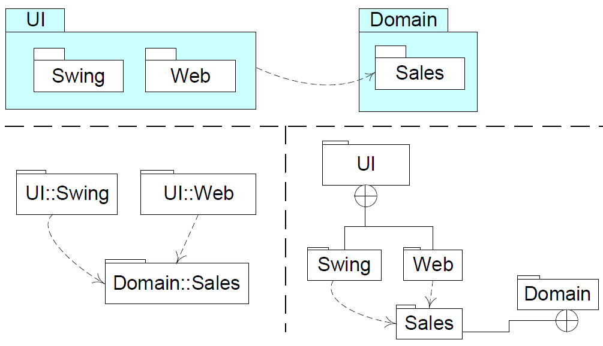

## Lecture 10
I missed this lecture sadly, but here is a summary of the slides
### UML and Architecture
#### Design in the Large
* Architecture
* Architectural Patterns
* Sources
    * Bennett, McRobb & Farmer, O-O Systems Analysis & Design, Chapter 13 *System Design and Architecture*
    * Larman, Applying UML and Patterns, Chapter 13 *Logical Architectures and UML Package Diagrams* (+ Ch 17 & Ch 39).
    * Sommerville, Software Engineering, Chapter 6 *Architectural Design*

#### Thing Big, Act Small, Fail Fast, Learn Rapidly
* Slogan from Lean Software Development (another Agile method)
    * Has the principle of *See the whole* amongst others
    * != do the whole design early!
* The remainder of the course is about seeing the whole when building  single system
* This is architectural thinking
    * It is the translation from the **problem domain** to the **solution concepts**
        * Technology with purpose
### Architecture Definition
#### Architecture
* Software architecture
    * The set of principal design decisions about the system
    * The heart software system
* Well-engineered software
    * Good software architecture
    * Good set of design decisions
* NB - This is very different from the other meaning of architecture in CS - hardware and associated abstractions
#### Definition
* Basic idea: it is about the **big** picture; the large scale
    * Motivations
    * Constraints
    * Organizations
    * Patterns
    * Responsibilities
> An architecture is the set of significant decisions about the organization of a software system, the selection of the structural elements and their interfaces by which the system is composed, together with their behaviour as specified in the collaborations among those elements, the composition of these structural and behavioural elements into progressively larger subsystems, and the architectural style that guides this organization—these elements and their interfaces, their collaborations, and their composition - Booch, Rumbaugh and Jacobson, *The UML User Guide*, 1999
* 
### UML Views
## Lecture 10
#### Process View (Component-and-Connector View)
* This view deals with concurrency and distrivution, system integrity, and fault tolerance
* It explains which components interact, and how they do so
* THe dynamic connections between different components at runtime
* Activity diagram
#### Physical View (Deployment View)
* This view describes how the software maps onto the hardware
* It shows networking and distribution
* It considers system requirements like reliability and performance
* Deals with the elemenets identified in the previous three views
* Deployement Diagram

### UML Packages
* Packages group elements
    * For example, groups of calsses in a single namespace
* Drawn as a rectangle with a smaller tab at the upper left
    * If members are shown within the package, name the tab
* Used to show the high level organization of a project
* A dashed arrow between packages indicates a dependency
#### Logical Architeture
* Shows large-scale organization of software classes, grouped by
    * Layers (course-grained)
    * Packages
    * Subsystems (finer-grained)
        * Cohesive responsibility for a major aspect of the system
*  Logical -> INdependent of actual deployment decisions
*  Seen notes provided on Vula:
    *  *Larman - Extractions from Chapter 13.pdf
#### Package Diagrams for Logical Architecture
* In UML logical paritioning is illustrated with pcakage diagrams

#### Layers Shown with UML package diagram

#### Various UML notations for package nesting

We generally use the first notation

#### Package Dependencies
* Dependency line indicats coupling of packages
    * Arrow points to the depended upon package
    * Implies change to depended upon package likely impacts dependent package
    * Robust architetures minimize depedencies

* When changing a package that has a dependency, you may need to consider the parts dependent on it as they may cause erroneous behaviour depening on the changes.
* So consider minimizing the dependencies on packages, as a change will lead to updating the package.

#### Ordering Work
* What can we start with?
* What can we do in prallel?
* How?
    * Developers can work independently on different layers simultaneously
* This can make prototyping easier
    * You can hardcode some value in that will return something
#### Type and Lollipop
* The `<<type>>` stereotype indicates that the class is an interface
> It has no member variables, and all of its member functions are pure virtual
* A shortcut for `<<type>>` classes is the *lollipop* notation to represent an interface
    * Shape depends on DrawingContext as shown by the dashed arrow (as usual)
    * The class WindowsDrwaingContext is derived from, or conforms to, the DrawingContext interfac

* Can use `<<interface>>` instead of `<<type>>`

* Anything that implements the VisitorInterface has to use the `visit()` and `getOrderTotal()` method

> If you want a professional home entertainment system. You get a nice speaker system. If the speaker system breaks, you can simply unplug the broken one and plug in the working one -> because home entertainment systems have a standard interface.
#### Components
##### Design Level Perspective
* A component represents a modular part of a system that encapsulates its contents and whose manifestation is replaceable within its environment
    * Defines its behaviour in terms of provided and required interfaces
    * Servers as a type defined by these provided and required interfaces
    * Can be composed of multiple classes, or components
* Intent of using components is to emphasize
    * That the interfaces are important, and
    * It is modular, self-contained and replaceable
        * It is a relatively stand-alone module
* Components does not represent concrete software
    * Can map to concrete artefacs such as a set of files
##### UML example
* At a large-grained level, a SQL database engine can be modelled as a component
> Any database taht understands the same version of SQL and supports the same transaction semantics can be subtituted
* At a finer grained level, any solution that implements the standard Java Message Service API can be used or replaced in a system

### Architecture Description

### Guidelines