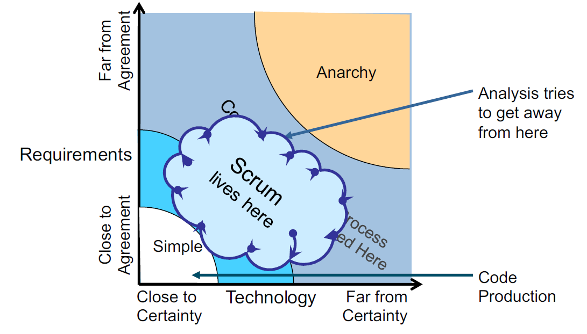
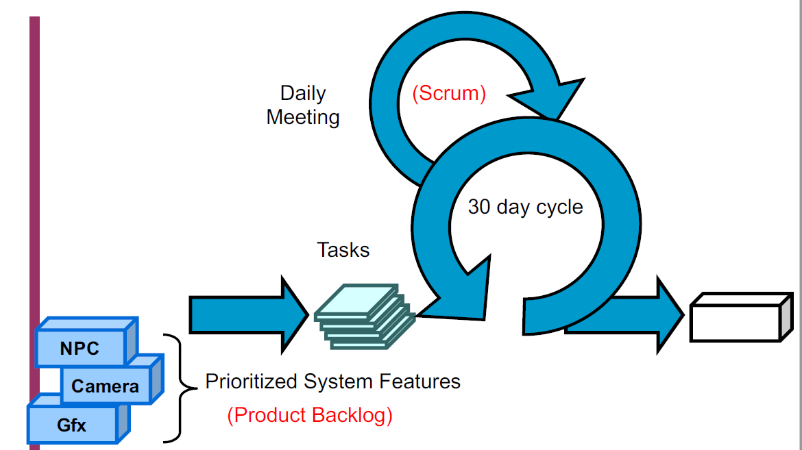

## Lecture 8
### Introduction
#### What is Scrum?
* Not an acronym
* Very little to do with rugby
* Simple to implement
* Designed to increase productivity
* Mature: from 1995 (feck, then I am mature)
* Scaleable
    * Can be used oon projects of any size
* Scrum is a **project management process**
* It is a lightweight development process to
    * Manage and control software and product development
* Embraces iterative and incremental practices
* Not "artefact-driven"
    * No large requirements documents, analysis specifications, design documents
    * Requires very few artefacts
    * It does require discipline
* Concentrating on achieving results
#### Warning
* No silver bullet
    * That is, it ain't a technique that compensates for lack of training or experience
* Scrum is not a panacea for all known development ills
    * A hot topic in the software and ames industry
> Panacea - solution to everything
#### Why Scrum?

#### Waterfall v Scrum
> Don't use waterfall

Waterfall Sample Project

Waterfall Functionality of Project

Scrum Sample Project

Scrum Functionality of Project

### Scrum Outline
#### Scrum Skeleton

* The lower circle represents an iteration of development that occur one after another
    * Output of each iteration is an increment of product
* The upper circle represents the daily inspection that occurs during the iteration
    * Individual team members meet to inspect each others' activities and make appropriate adaptations.
* Driving the iteration is a list of requirements
* This cycle repeats until the project is complete

* Product features are broken down into individual tasks by programmer team
* Worked on for an iteration of (two weeks to) a month
* Account for their tasks and to each other in a daily meeting
* End of the iteration a product review occurs of all work done in that iteration
* Project directors and publishers determine how to prioritize the next iteration bsed on the work done in the latest
* The heart of Scrum lies in the iteration
* The team
    * Takes a look at the requirements
    * Considers the available technology
    * Evaluates its own skills and capabilities
    * Determine how to build the functionality, modifying its approach daily as it encounters new complexities, difficulties and surprises
* This creative process is the heart of the Scrum's productivity
#### Scrum Roles
* There are only three SCRUM roles
1. Product Owner
2. Team
3. ScrumMaster
* All involved are Players or Spectators
    * Players - committed, accountable, responsible
    * Spectators - interested, consults, informed (management)
##### Product Owner
* Represent the interests of everyone with a stake in the project and its resulting system
    * Achieves initial and ongoing funding
    * creates
        * The project's initial overall requirements
        * Return on investment (ROI) objectives
        * release plans
##### Product Owner & Product Backlog
* List of requirements is called the Product Backlog
* Product Owner uses the Product Backlog to ensure the most valuable functionality is produced first and built upon
    * Achieved by frequently prioritizing the product backlog to queue up the most valuable requirements for the next iteration
##### Scrum Team
* Typically will be ten or fewer
    * Larger teams can work well if they understand how to organise and manage themselves
* Responsible for developing functionality
* Are self-managing, self-organising, cross functional
* Responsible for deciding how to turn Product-Backlog into an increment of functionality within an iteration
* Managing their own work to do so
* Members are collectively responsible for the success of each iteration and the project as a whole
##### Scrum Master
* Responsible for the Scrum process
    * Teaching Scrum to everyone involved in the project
    * implementing Scrum so that it fits within an organization's culture and still delivers the expected benefits
    * ensuring that everyone follows Scrum rules and practices
### Scrum Flow
#### Scrum Rules
* ScrumMaster ensures everyone on a project follows the rules
* Hold the process together so everyone knows how to play
    * If rules aren't enforced, people waste time figuring out what to do 
    * If the rules are disputed, time is lost while everyone waits for resolution
* The rules have worked in thousands of successful projects
* To change rules, use Sprint retrospective meeting:
    * Changes should originate from the Team, not management

* Any project starts with a vision
    * In XP terms the "System Metaphor"
    * Leads to the logical architecture
* The Product Owner
##### Sprints
* Work is done in Sprints
    * Iteration of 30 consecutve calendar days
    * Initiated with a Sprint planning meeting
        * The product owner and team

### Scrum Meetings
#### Sprint Planning
People planing for the 30 day sprint
Who do we give them to, and how do we give them to people
##### Time Boxed
* Sprint
#### Daily Scrum
##### Meeting
* Time boxed to 15 minutes
    * No matter how many team members
* Held in the same place at the same time every work day
    * Best is first thing in the day so members think of what htye did the day before and what they plan to do today
* All team
* Why daily?
* ScrumMaster goes round the room until everyone has reported
* Each team member responds to only **3 questions**?
1. What have you done since the Daily Scrum?
2. What will you do on th eproject between now and the next Daily Scrum meeting?
3. What stands in the way of you rmeeting your commitments to this sprint and this project?
* Purpose
    * Syncronize the work all the team members daily
    * Schedule any meetings needed to help progress
* Team members should not digress into issues,
##### Time Boxed
##### Sprint
##### Backlog
##### Non-viable
##### Review Meeting

#### Sprint Review
##### Meeting
##### Retrospective

### Process Artefacts
#### Process Overview
Burndown Chart
#### Scrum's Artefacts
* Srum has few artefacts
    * Produt backlog
    * Sprint backlog
    * Burndown charts
* Can be managed using an Excel spreadsheet
    * More advanced / complicated tools exits
        * Expensive
        * Web-based - no good for the project manager who traverls
        * Still under development
#### Product Backlog
* Prioritised list of first cut refinements
* The product Owner is free to
    * Adjust the order in which Product Backlog items are developed
    * Add new items
* The brings in the oncept of agility and change
#### Sprint Backlog
...